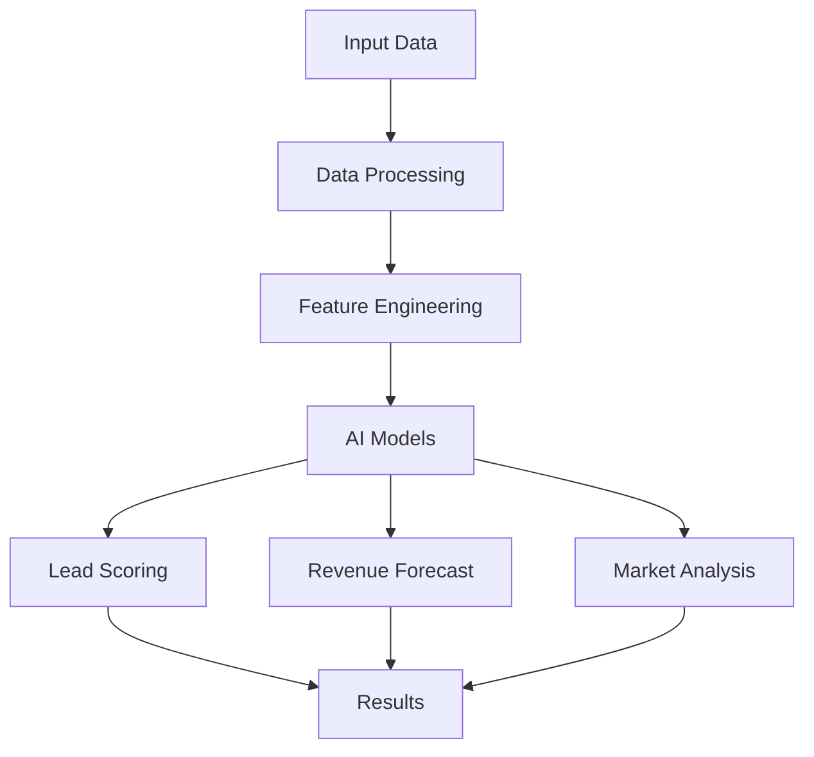

# Sales & Intelligence Platform

[](https://github.com/your-org/sales-intelligence/actions)
[](ai/version.svg)
[](ai/gpu-support.svg)
[](coverage/badge.svg)
[](LICENSE)

Enterprise-grade AI-driven sales optimization platform designed to drive 150% business growth through enhanced decision-making capabilities, automated lead generation, and data-driven customer insights.

## Overview

The Sales & Intelligence Platform leverages cutting-edge AI/ML technologies to revolutionize sales operations:

- **AI-Powered Analytics**: TensorFlow-based predictive modeling with GPU acceleration
- **Lead Scoring**: Real-time lead qualification using neural networks
- **Revenue Forecasting**: LSTM-based predictive analytics with 95% confidence intervals
- **Market Intelligence**: BERT-powered competitor analysis and trend detection
- **Enterprise Integration**: Seamless connectivity with CRM, communication, and analytics tools

## Architecture

### Core Components

- **Frontend**: React 18.2+ with TypeScript 5.0+
- **Backend API**: Node.js 20 LTS with Express
- **AI Services**: Python 3.11+ with TensorFlow 2.14
- **Data Processing**: GPU-accelerated analytics pipeline
- **Infrastructure**: AWS EKS with Kubernetes orchestration

### AI Model Architecture



## Prerequisites

### Software Requirements
- Node.js >= 20.0.0
- Python >= 3.11
- Docker and Docker Compose
- Kubernetes CLI
- AWS CLI

### Hardware Requirements
- NVIDIA GPU with 8GB+ VRAM (Tesla T4 or better)
- CUDA Toolkit >= 11.8
- cuDNN >= 8.6

## Quick Start

1. Clone the repository:
```bash
git clone https://github.com/your-org/sales-intelligence.git
cd sales-intelligence
```

2. Install dependencies:
```bash
# Backend dependencies
cd src/backend
npm ci

# Frontend dependencies
cd ../web
npm ci

# AI environment setup
python -m venv env
source env/bin/activate  # or `env\Scripts\activate` on Windows
pip install -r requirements.txt
```

3. Configure environment:
```bash
# Backend configuration
cp src/backend/.env.example src/backend/.env

# Frontend configuration
cp src/web/.env.example src/web/.env.local
```

4. Start development environment:
```bash
# Start services with Docker Compose
docker-compose up -d

# Start backend development server
cd src/backend
npm run dev

# Start frontend development server
cd ../web
npm run dev
```

## AI Model Management

### Model Training

```bash
# Lead Scoring Model
cd src/backend/src/ai/lead-scoring
python model.py --mode train

# Revenue Forecasting Model
cd ../revenue-forecast
python model.py --mode train

# Market Intelligence Model
cd ../market-intelligence
python analyzer.py --mode train
```

### Model Deployment

```bash
# Deploy AI services to Kubernetes
kubectl apply -f k8s/ai-services/

# Monitor model performance
kubectl logs -f deployment/ai-service
```

## Security

- End-to-end encryption for data transmission
- Role-based access control (RBAC)
- OAuth 2.0 authentication
- API request validation
- Rate limiting
- Security headers and CSP
- Regular security audits

## Deployment

### Production Environment

1. Build Docker images:
```bash
docker-compose build
```

2. Deploy to Kubernetes:
```bash
kubectl apply -f k8s/
```

### Scaling Configuration

```yaml
services:
  backend:
    deploy:
      resources:
        limits:
          cpus: '2'
          memory: 4G
  ai_service:
    deploy:
      resources:
        reservations:
          devices:
            - driver: nvidia
              count: 1
              capabilities: [gpu]
```

## Documentation

- [Backend Documentation](src/backend/README.md)
- [Frontend Documentation](src/web/README.md)
- [API Documentation](docs/api.md)
- [AI Model Documentation](docs/ai-models.md)

## Contributing

1. Fork the repository
2. Create your feature branch (`git checkout -b feature/amazing-feature`)
3. Commit your changes (`git commit -m 'Add amazing feature'`)
4. Push to the branch (`git push origin feature/amazing-feature`)
5. Open a Pull Request

## License

Copyright © 2024 Sales & Intelligence Platform. All rights reserved.