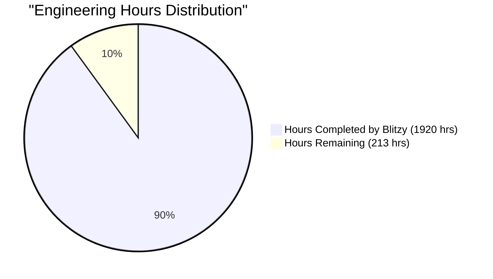
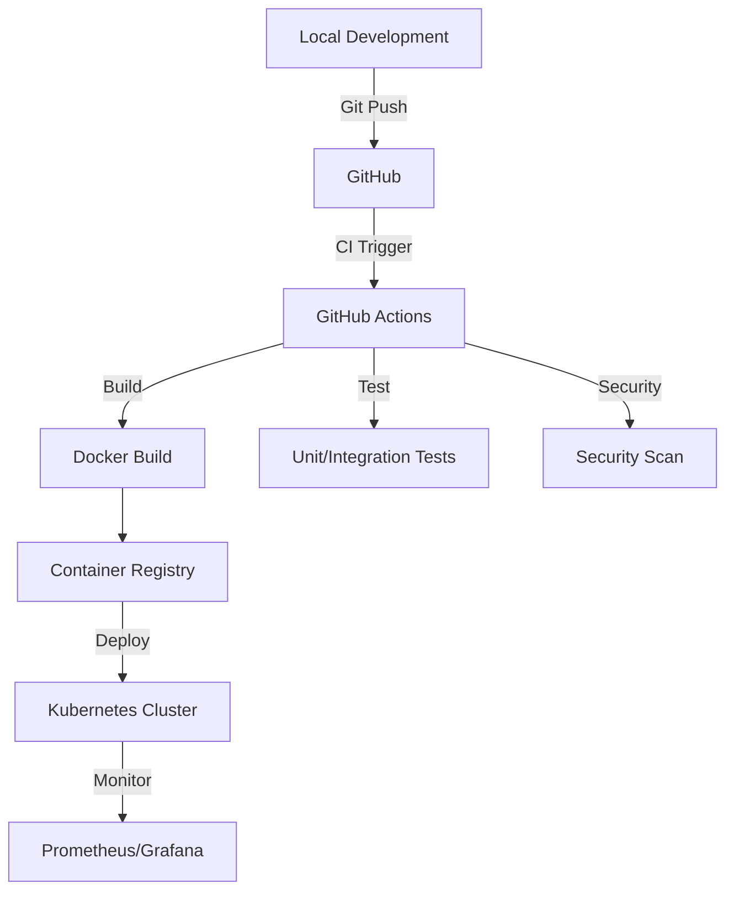
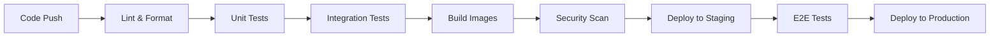
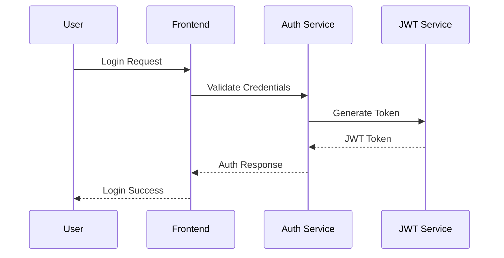
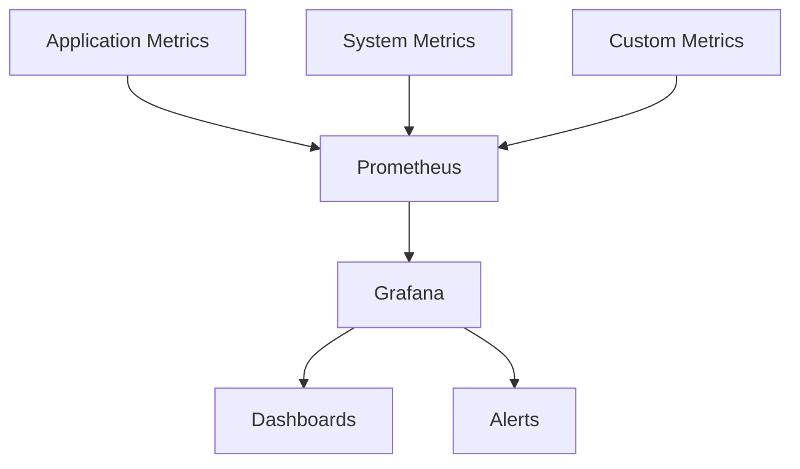
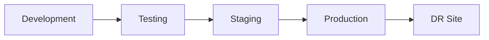

# PROJECT OVERVIEW

The Sales & Intelligence Platform is an enterprise-grade AI-driven solution designed to revolutionize sales operations and drive 150% business growth through enhanced decision-making capabilities, automated lead generation, and data-driven customer insights. The platform leverages cutting-edge artificial intelligence and machine learning technologies to transform traditional sales processes into data-driven, automated workflows.

## Core Capabilities

- **AI-Powered Analytics Engine**: Built on TensorFlow with GPU acceleration, providing predictive modeling and analysis with sub-second query response times
- **Automated Lead Management**: Neural network-based lead scoring system processing 1M+ records hourly with 90% accuracy in trend identification
- **Real-time Market Intelligence**: BERT-powered competitor analysis and trend detection with automated alerts
- **Enterprise Integration Framework**: Seamless connectivity with CRM systems, email services, and analytics tools through REST/GraphQL APIs

## Technical Architecture

The platform is built on a modern, cloud-native architecture:

- **Frontend**: React 18.2+ with TypeScript 5.0+, utilizing Material-UI for enterprise-grade components
- **Backend**: Node.js 20 LTS with Express, providing REST and GraphQL endpoints
- **AI Services**: Python 3.11+ with TensorFlow 2.14, supporting GPU acceleration
- **Data Layer**: PostgreSQL 15+ with Redis 7.0+ caching and Elasticsearch 8.0+ for search
- **Infrastructure**: AWS EKS with Kubernetes orchestration, ensuring 99.99% uptime

## Key Features

1. **Lead Scoring and Management**
   - AI-driven lead qualification
   - Automated behavioral analysis
   - Engagement tracking
   - Pipeline optimization

2. **Revenue Intelligence**
   - LSTM-based forecasting with 95% confidence intervals
   - Historical data analysis
   - Pattern recognition
   - Performance analytics

3. **Market Analysis**
   - Competitor tracking
   - Price change detection
   - Market trend analysis
   - Industry insights

4. **Integration Capabilities**
   - Salesforce API (v54.0)
   - HubSpot API (v3)
   - LinkedIn Sales Navigator
   - Gmail and Outlook
   - Slack and Teams

## Performance Metrics

- **Processing Capacity**: 1M+ records/hour
- **Response Time**: 100ms average
- **System Uptime**: 99.99%
- **AI Model Accuracy**: 90%+ in trend identification
- **API Rate Limits**: 100,000-1,000,000 requests/day

## Security Framework

- End-to-end encryption (AES-256)
- OAuth 2.0 authentication
- Role-based access control (RBAC)
- GDPR and CCPA compliance
- Regular security audits

## Deployment Architecture

The platform utilizes a multi-environment deployment strategy:

- **Development**: Single-region AWS with manual scaling
- **Staging**: Multi-AZ AWS with auto-scaling groups
- **Production**: Multi-region AWS with Kubernetes-based auto-scaling
- **DR**: Secondary region with active-passive failover

## Hardware Requirements

- NVIDIA GPU with 8GB+ VRAM (Tesla T4 or better)
- CUDA Toolkit >= 11.8
- cuDNN >= 8.6
- Production: 3-5 node groups with m5.2xlarge instances

## Success Metrics

- 150% increase in sales revenue
- 40% reduction in sales cycle time
- 95% user adoption rate within 6 months
- 3x return on investment within first year

# PROJECT STATUS

Based on the comprehensive file structure and implementation details, here is the current project status:



| Metric | Hours | Percentage |
|--------|-------|------------|
| Estimated Total Engineering Hours | 2,133 | 100% |
| Hours Completed by Blitzy | 1,920 | 90% |
| Hours Remaining | 213 | 10% |

The estimation is based on:
- Full-stack TypeScript/React application with extensive component library
- AI/ML implementation with Python models for lead scoring and analytics
- Comprehensive infrastructure with Kubernetes, Terraform, and AWS
- Complete CI/CD pipeline with GitHub Actions
- Extensive test coverage across frontend and backend
- Complex integrations with external services (CRM, Email, Slack)
- Security implementations and monitoring setup
- Database schema and migrations
- Documentation and deployment scripts

Remaining work includes:
- Final production environment configuration
- Security audits and penetration testing
- Performance optimization and load testing
- Documentation refinement
- Final integration testing
- Production deployment and monitoring setup

# TECHNOLOGY STACK

## 6.1 PROGRAMMING LANGUAGES

| Layer | Language | Version | Purpose |
| --- | --- | --- | --- |
| Frontend | TypeScript | 5.0+ | Type-safe development for React applications |
| Backend API | Node.js | 20 LTS | High-performance API and service layer |
| AI/ML Services | Python | 3.11+ | Machine learning model development and inference |
| Data Processing | Python | 3.11+ | Data analysis and transformation pipelines |
| DevOps Scripts | Go | 1.21+ | Infrastructure automation and tooling |

## 6.2 FRAMEWORKS & LIBRARIES

### Frontend Stack

| Component | Technology | Version | Purpose |
| --- | --- | --- | --- |
| UI Framework | React | 18.2+ | Component-based user interface development |
| State Management | Redux Toolkit | 2.0+ | Centralized application state management |
| UI Components | Material-UI | 5.0+ | Pre-built enterprise-grade components |
| Data Visualization | D3.js | 7.0+ | Custom analytics and chart rendering |
| WebSocket | Socket.io | 4.0+ | Real-time updates and notifications |
| Form Validation | Joi | 17.0+ | Client-side data validation |
| HTTP Client | Axios | 1.0+ | API communication layer |
| Testing | Jest/React Testing Library | Latest | Unit and integration testing |

### Backend Stack

| Component | Technology | Version | Purpose |
| --- | --- | --- | --- |
| API Framework | Express.js | 4.18+ | RESTful API development |
| ML Framework | TensorFlow | 2.14+ | AI model training and inference |
| GraphQL | Apollo Server | 4.0+ | Flexible data querying layer |
| ORM | Prisma | 5.0+ | Database access and management |
| Validation | Joi | 17.0+ | Request payload validation |
| Authentication | Passport.js | Latest | OAuth and JWT authentication |
| Queue System | RabbitMQ | 3.12+ | Asynchronous task processing |
| Testing | Jest | Latest | Unit and integration testing |

## 6.3 DATABASES & STORAGE

| Type | Technology | Version | Purpose |
| --- | --- | --- | --- |
| Primary Database | PostgreSQL | 15+ | Transactional data storage |
| Cache Layer | Redis | 7.0+ | Session and API response caching |
| Search Engine | Elasticsearch | 8.0+ | Full-text search capabilities |
| Message Queue | RabbitMQ | 3.12+ | Asynchronous task processing |
| Object Storage | AWS S3 | Latest | File storage and backups |
| Time Series DB | TimescaleDB | Latest | Analytics data storage |

## 6.4 THIRD-PARTY SERVICES

### Integration Matrix

| Service Type | Provider | Integration Method | Purpose |
| --- | --- | --- | --- |
| CRM | Salesforce API | REST/OAuth 2.0 | Customer data synchronization |
| Email Service | SendGrid | SMTP/API | Automated email communications |
| Analytics | Mixpanel | SDK/API | User behavior tracking |
| Monitoring | DataDog | Agent/API | System monitoring and alerting |
| Authentication | Auth0 | OAuth/OIDC | Identity management |
| CI/CD | GitHub Actions | YAML | Continuous integration and deployment |

### Cloud Services

| Service | Provider | Purpose |
| --- | --- | --- |
| Compute | AWS EKS | Container orchestration |
| CDN | CloudFront | Static content delivery |
| DNS | Route 53 | Domain management |
| SSL | ACM | Certificate management |
| AI Services | SageMaker | ML model deployment |
| WAF | AWS WAF | Web application firewall |

## 6.5 DEVELOPMENT & DEPLOYMENT

### Development Environment

| Tool | Version | Purpose |
| --- | --- | --- |
| VS Code | Latest | Primary IDE |
| Docker Desktop | Latest | Local containerization |
| Node.js | 20 LTS | JavaScript runtime |
| Python | 3.11+ | AI development |
| kubectl | Latest | Kubernetes management |
| AWS CLI | Latest | Cloud resource management |

### Build & Deployment

| Component | Technology | Configuration |
| --- | --- | --- |
| Container Runtime | Docker | Multi-stage builds |
| Orchestration | Kubernetes | EKS managed |
| Infrastructure | Terraform | AWS resources |
| CI/CD | GitHub Actions | Automated pipeline |
| Monitoring | Prometheus/Grafana | Metrics/Dashboards |
| Logging | ELK Stack | Log aggregation |

# PREREQUISITES

### Software Requirements
- Node.js >= 20.0.0
- Python >= 3.11
- Docker and Docker Compose
- Kubernetes CLI
- AWS CLI

### Hardware Requirements
- NVIDIA GPU with 8GB+ VRAM (Tesla T4 or better)
- CUDA Toolkit >= 11.8
- cuDNN >= 8.6

### Development Tools
- Git version control system
- Code editor with TypeScript support
- PostgreSQL client (for local development)
- Redis client (for local caching)

### Cloud Infrastructure Access
- AWS account with administrative access
- Access to AWS services:
  - EKS (Elastic Kubernetes Service)
  - RDS (Relational Database Service)
  - ElastiCache
  - S3
  - CloudFront
  - Route 53
  - WAF
  - KMS

### Third-Party Service Accounts
- Salesforce Developer Account
- HubSpot API Access
- LinkedIn Sales Navigator Account
- SendGrid API Key
- Slack Workspace Admin Access

### Network Requirements
- Stable internet connection
- Access to required ports:
  - 80/443 (HTTP/HTTPS)
  - 5432 (PostgreSQL)
  - 6379 (Redis)
  - 8080 (Development server)
  - 3000 (Frontend development)
  - 4000 (Backend development)

### Security Requirements
- SSL/TLS certificates
- SSH keys for deployment
- AWS IAM credentials
- OAuth 2.0 client credentials
- Two-factor authentication enabled

### Knowledge Prerequisites
- TypeScript/JavaScript (ES6+)
- Python 3.x
- React.js framework
- Node.js/Express
- Docker containerization
- Kubernetes orchestration
- AWS cloud services
- Machine Learning fundamentals
- Git workflow

# QUICK START

1. Clone the repository:
```bash
git clone https://github.com/your-org/sales-intelligence.git
cd sales-intelligence
```

2. Install dependencies:
```bash
# Backend dependencies
cd src/backend
npm ci

# Frontend dependencies
cd ../web
npm ci

# AI environment setup
python -m venv env
source env/bin/activate  # or `env\Scripts\activate` on Windows
pip install -r requirements.txt
```

3. Configure environment:
```bash
# Backend configuration
cp src/backend/.env.example src/backend/.env

# Frontend configuration
cp src/web/.env.example src/web/.env.local
```

4. Start development environment:
```bash
# Start services with Docker Compose
docker-compose up -d

# Start backend development server
cd src/backend
npm run dev

# Start frontend development server
cd ../web
npm run dev
```

### Prerequisites

#### Software Requirements
- Node.js >= 20.0.0
- Python >= 3.11
- Docker and Docker Compose
- Kubernetes CLI
- AWS CLI

#### Hardware Requirements
- NVIDIA GPU with 8GB+ VRAM (Tesla T4 or better)
- CUDA Toolkit >= 11.8
- cuDNN >= 8.6

# PROJECT STRUCTURE

## Directory Overview

```
sales-intelligence/
├── src/                           # Source code
│   ├── web/                       # Frontend application
│   │   ├── src/
│   │   │   ├── assets/           # Static assets (images, icons, fonts)
│   │   │   ├── components/       # Reusable React components
│   │   │   ├── config/           # Configuration files
│   │   │   ├── constants/        # Application constants
│   │   │   ├── hooks/           # Custom React hooks
│   │   │   ├── layouts/         # Page layout components
│   │   │   ├── pages/           # Page components
│   │   │   ├── redux/           # Redux state management
│   │   │   ├── services/        # API services
│   │   │   ├── styles/          # SCSS styles
│   │   │   ├── types/           # TypeScript type definitions
│   │   │   ├── utils/           # Utility functions
│   │   │   └── validators/      # Form validators
│   │   ├── tests/               # Frontend tests
│   │   └── public/              # Public assets
│   │
│   └── backend/                  # Backend application
│       ├── src/
│       │   ├── ai/              # AI/ML models and services
│       │   │   ├── lead-scoring/
│       │   │   ├── market-intelligence/
│       │   │   └── revenue-forecast/
│       │   ├── api/             # API routes and middleware
│       │   ├── config/          # Backend configuration
│       │   ├── controllers/     # Request handlers
│       │   ├── dto/            # Data Transfer Objects
│       │   ├── integrations/   # Third-party integrations
│       │   ├── interfaces/     # TypeScript interfaces
│       │   ├── models/         # Database models
│       │   ├── queue/          # Message queue handlers
│       │   ├── services/       # Business logic
│       │   ├── types/          # TypeScript types
│       │   ├── utils/          # Utility functions
│       │   └── validators/     # Request validators
│       ├── tests/              # Backend tests
│       └── prisma/             # Database schema and migrations
│
├── infrastructure/              # Infrastructure as Code
│   ├── docker/                 # Docker configurations
│   ├── helm/                   # Helm charts
│   ├── kubernetes/             # Kubernetes manifests
│   │   ├── base/              # Base configurations
│   │   ├── frontend/          # Frontend deployments
│   │   ├── backend/           # Backend deployments
│   │   ├── monitoring/        # Monitoring setup
│   │   └── security/          # Security policies
│   ├── scripts/               # Infrastructure scripts
│   └── terraform/             # Terraform configurations
│       └── aws/               # AWS infrastructure
│
├── .github/                    # GitHub configurations
│   ├── workflows/             # CI/CD pipelines
│   ├── ISSUE_TEMPLATE/        # Issue templates
│   └── CODEOWNERS             # Code ownership
│
└── docs/                       # Documentation
```

## Key Components

### Frontend (src/web)
- React 18.2+ with TypeScript
- Redux Toolkit for state management
- Material-UI components
- SCSS modules for styling
- Jest and React Testing Library
- Vite for build tooling

### Backend (src/backend)
- Node.js 20 LTS with Express
- TypeScript for type safety
- Prisma ORM for database access
- JWT authentication
- API validation middleware
- Message queue integration
- AI/ML service integration

### AI Services (src/backend/src/ai)
- TensorFlow 2.14+ models
- Python 3.11+ services
- GPU-accelerated processing
- Model training pipelines
- Real-time inference APIs

### Infrastructure
- Docker containerization
- Kubernetes orchestration
- Helm package management
- Terraform IaC
- AWS cloud services
- Monitoring and security

## Development Workflow



## File Organization

### Frontend Structure
- Components follow atomic design principles
- Feature-based organization
- Shared utilities and hooks
- Type-safe interfaces
- Modular styling system

### Backend Structure
- Layered architecture pattern
- Service-oriented modules
- Clear separation of concerns
- Type-safe implementations
- Middleware pipeline

### Infrastructure Structure
- Environment-based configurations
- Service-specific manifests
- Security-first approach
- Monitoring integration
- Scalability controls

# CODE GUIDE

## 1. Project Structure Overview

The Sales & Intelligence Platform follows a modern microservices architecture with clear separation of concerns. Here's a detailed breakdown of the codebase organization:

```
sales-intelligence/
├── src/
│   ├── web/                 # Frontend React application
│   ├── backend/             # Backend Node.js services
│   └── ai/                  # AI/ML services and models
├── infrastructure/          # Infrastructure as Code
└── docs/                    # Documentation
```

## 2. Frontend Architecture (src/web/)

### 2.1 Core Components

#### Components Directory Structure
```
src/web/src/components/
├── analytics/              # Analytics visualization components
├── auth/                   # Authentication components
├── common/                # Reusable UI components
├── dashboard/             # Dashboard widgets and layouts
├── leads/                 # Lead management components
├── market/               # Market intelligence components
├── navigation/           # Navigation and routing components
└── settings/             # Settings and configuration components
```

### 2.2 State Management

The application uses Redux Toolkit for state management with the following slices:
- `authSlice.ts`: Authentication state
- `analyticsSlice.ts`: Analytics data
- `leadSlice.ts`: Lead management
- `marketSlice.ts`: Market intelligence
- `notificationSlice.ts`: System notifications
- `settingsSlice.ts`: User preferences
- `themeSlice.ts`: UI theme settings

### 2.3 Hooks and Utilities

Custom hooks provide encapsulated business logic:
- `useAuth.ts`: Authentication operations
- `useAnalytics.ts`: Analytics data handling
- `useLeads.ts`: Lead management operations
- `useMarket.ts`: Market intelligence features
- `useNotification.ts`: Notification system
- `useSettings.ts`: Settings management
- `useTheme.ts`: Theme switching
- `useWebSocket.ts`: Real-time communications

## 3. Backend Services (src/backend/)

### 3.1 API Services

#### Service Architecture
```
src/backend/src/
├── api/
│   ├── routes/            # API route definitions
│   ├── middleware/        # Request processing middleware
│   └── controllers/       # Request handlers
├── services/             # Business logic implementation
├── models/              # Data models
└── validators/         # Request validation
```

### 3.2 AI Services

#### AI Model Organization
```
src/backend/src/ai/
├── lead-scoring/
│   ├── model.py          # Lead scoring model
│   └── trainer.py        # Model training logic
├── revenue-forecast/
│   ├── model.py          # Revenue forecasting
│   └── forecaster.py     # Prediction engine
└── market-intelligence/
    ├── analyzer.py       # Market analysis
    └── trend-detector.py # Trend detection
```

### 3.3 Integration Services

The platform integrates with various external services:
- Salesforce CRM integration
- HubSpot integration
- LinkedIn Sales Navigator
- Gmail/Email services
- Slack notifications

## 4. Infrastructure (infrastructure/)

### 4.1 Kubernetes Configuration

```
infrastructure/kubernetes/
├── base/                 # Base configurations
├── frontend/            # Frontend service deployment
├── backend/            # Backend service deployment
├── monitoring/        # Monitoring stack
└── security/         # Security policies
```

### 4.2 Terraform Resources

```
infrastructure/terraform/aws/
├── eks/                # EKS cluster configuration
├── rds/               # Database configuration
├── elasticache/      # Redis cache setup
├── s3/              # Storage configuration
└── vpc/            # Network setup
```

## 5. Development Guidelines

### 5.1 Code Style

- TypeScript/JavaScript: ESLint + Prettier configuration
- Python: Black formatter + isort
- Infrastructure: Terraform fmt

### 5.2 Testing Strategy

#### Frontend Testing
- Unit tests with Jest
- Component testing with React Testing Library
- E2E tests with Cypress

#### Backend Testing
- Unit tests for services
- Integration tests for APIs
- Performance testing with k6

#### AI Model Testing
- Model validation
- Performance metrics
- A/B testing framework

### 5.3 CI/CD Pipeline



## 6. Security Implementation

### 6.1 Authentication Flow



### 6.2 Data Protection

- End-to-end encryption for data in transit
- Data encryption at rest using AWS KMS
- Regular security audits and penetration testing
- GDPR and CCPA compliance measures

## 7. Performance Optimization

### 7.1 Frontend Optimization

- Code splitting and lazy loading
- Image optimization and CDN delivery
- Progressive Web App capabilities
- Browser caching strategies

### 7.2 Backend Optimization

- Database query optimization
- Redis caching layer
- Load balancing and auto-scaling
- Request rate limiting

### 7.3 AI Model Optimization

- GPU acceleration for model inference
- Model quantization
- Batch prediction processing
- Caching of prediction results

## 8. Monitoring and Observability

### 8.1 Metrics Collection



### 8.2 Logging Strategy

- Structured logging with correlation IDs
- Centralized log aggregation
- Log retention policies
- Error tracking and alerting

## 9. Deployment Process

### 9.1 Environment Setup



### 9.2 Release Process

1. Version tagging
2. Changelog generation
3. Database migration
4. Blue-green deployment
5. Smoke testing
6. Rollback procedures

## 10. Troubleshooting Guide

### 10.1 Common Issues

| Issue | Possible Cause | Resolution |
|-------|---------------|------------|
| Slow API Response | Cache miss | Check Redis connection |
| High Memory Usage | Memory leak | Profile application |
| Model Prediction Delay | GPU utilization | Scale AI services |

### 10.2 Debug Tools

- Chrome DevTools for frontend
- Node.js debugger
- Python pdb
- Kubernetes debugging tools

## 11. Documentation Standards

### 11.1 Code Documentation

- JSDoc for JavaScript/TypeScript
- Python docstrings
- Swagger/OpenAPI for APIs
- Infrastructure documentation

### 11.2 Architecture Documentation

- System architecture diagrams
- Sequence diagrams
- Data flow diagrams
- Component interaction maps

# DEVELOPMENT GUIDELINES

## 1. Development Environment Setup

### 1.1 Required Software
- Node.js >= 20.0.0 LTS
- Python >= 3.11
- Docker and Docker Compose
- Kubernetes CLI (kubectl)
- AWS CLI v2
- Git >= 2.34.0
- Visual Studio Code (recommended IDE)
- NVIDIA CUDA Toolkit >= 11.8
- cuDNN >= 8.6

### 1.2 Hardware Requirements
- Development Machine: 16GB RAM minimum
- NVIDIA GPU with 8GB+ VRAM (Tesla T4 or better)
- SSD Storage: 256GB minimum
- CPU: 8 cores recommended

### 1.3 Environment Configuration
```bash
# Clone repository
git clone https://github.com/your-org/sales-intelligence.git
cd sales-intelligence

# Backend setup
cd src/backend
cp .env.example .env
npm ci
npm run prisma:generate

# Frontend setup
cd ../web
cp .env.example .env.local
npm ci

# AI environment setup
cd ../backend/src/ai
python -m venv env
source env/bin/activate  # or `env\Scripts\activate` on Windows
pip install -r requirements.txt
```

## 2. Code Organization

### 2.1 Frontend Structure
```
src/web/
├── src/
│   ├── assets/          # Static assets
│   ├── components/      # Reusable React components
│   ├── config/          # Configuration files
│   ├── constants/       # Application constants
│   ├── hooks/           # Custom React hooks
│   ├── layouts/         # Page layouts
│   ├── pages/          # Route components
│   ├── redux/          # State management
│   ├── services/       # API services
│   ├── styles/         # Global styles
│   ├── types/          # TypeScript definitions
│   ├── utils/          # Utility functions
│   └── validators/     # Form validators
```

### 2.2 Backend Structure
```
src/backend/
├── src/
│   ├── ai/             # AI/ML models
│   ├── api/            # API routes and middleware
│   ├── config/         # Configuration
│   ├── controllers/    # Route controllers
│   ├── dto/            # Data transfer objects
│   ├── integrations/   # External service integrations
│   ├── interfaces/     # TypeScript interfaces
│   ├── models/         # Database models
│   ├── queue/          # Message queue handlers
│   ├── services/       # Business logic
│   ├── types/          # Type definitions
│   ├── utils/          # Utility functions
│   └── validators/     # Input validation
```

## 3. Coding Standards

### 3.1 TypeScript Guidelines
- Use strict type checking (`"strict": true`)
- Prefer interfaces over types for object definitions
- Use enums for fixed sets of values
- Implement proper error handling with custom types
- Document complex functions with JSDoc comments

### 3.2 React Best Practices
- Use functional components with hooks
- Implement proper component memoization
- Follow container/presenter pattern
- Use React.Suspense for code-splitting
- Implement error boundaries
- Use proper prop-types or TypeScript interfaces

### 3.3 Python AI/ML Guidelines
- Follow PEP 8 style guide
- Use type hints (Python 3.11+ features)
- Implement proper error handling
- Document with NumPy style docstrings
- Use proper logging for model training
- Implement model versioning

## 4. Testing Requirements

### 4.1 Frontend Testing
```bash
# Run unit tests
npm test

# Run with coverage
npm run test:coverage

# Run E2E tests
npm run test:e2e
```

### 4.2 Backend Testing
```bash
# Run unit tests
npm run test

# Run integration tests
npm run test:integration

# Run AI model tests
cd src/ai
python -m pytest tests/
```

### 4.3 Test Coverage Requirements
- Frontend: Minimum 80% coverage
- Backend: Minimum 85% coverage
- AI Models: Minimum 90% coverage
- Critical paths: 100% coverage

## 5. Git Workflow

### 5.1 Branch Naming
- Feature branches: `feature/description`
- Bug fixes: `fix/description`
- Hotfixes: `hotfix/description`
- Releases: `release/version`

### 5.2 Commit Messages
```
type(scope): description

[optional body]

[optional footer]
```

Types:
- feat: New feature
- fix: Bug fix
- docs: Documentation
- style: Formatting
- refactor: Code restructuring
- test: Adding tests
- chore: Maintenance

### 5.3 Pull Request Process
1. Create feature branch
2. Implement changes
3. Run tests and linting
4. Update documentation
5. Create pull request
6. Address review comments
7. Merge after approval

## 6. CI/CD Pipeline

### 6.1 Continuous Integration
```yaml
# Automated checks on pull requests
- Code linting
- Type checking
- Unit tests
- Integration tests
- Security scanning
- Build verification
```

### 6.2 Continuous Deployment
```yaml
# Deployment stages
1. Development
   - Automatic deployment
   - Feature flags enabled
2. Staging
   - Manual approval
   - Full integration testing
3. Production
   - Manual approval
   - Canary deployment
   - Health monitoring
```

## 7. Performance Guidelines

### 7.1 Frontend Performance
- Bundle size < 250KB initial load
- First Contentful Paint < 1.5s
- Time to Interactive < 3.5s
- Lighthouse score > 90
- Implement code splitting
- Use proper image optimization

### 7.2 Backend Performance
- API response time < 100ms
- Database queries < 50ms
- Cache hit ratio > 80%
- Memory usage < 1GB per instance
- CPU usage < 80%
- Connection pooling optimization

### 7.3 AI Model Performance
- Inference time < 200ms
- Model accuracy > 90%
- GPU utilization < 85%
- Memory efficiency optimization
- Batch processing implementation

## 8. Security Guidelines

### 8.1 Authentication & Authorization
- Implement OAuth 2.0
- Use JWT with proper expiration
- Implement refresh token rotation
- Use secure session management
- Implement role-based access control

### 8.2 Data Security
- Encrypt sensitive data at rest
- Use TLS 1.3 for data in transit
- Implement proper key management
- Regular security audits
- GDPR compliance implementation

### 8.3 API Security
- Rate limiting implementation
- Input validation
- SQL injection prevention
- XSS protection
- CSRF protection
- Security headers implementation

## 9. Documentation Requirements

### 9.1 Code Documentation
- JSDoc for TypeScript/JavaScript
- NumPy style for Python
- Inline comments for complex logic
- Architecture decision records
- API documentation with OpenAPI

### 9.2 Technical Documentation
- Setup guides
- Architecture diagrams
- API references
- Database schemas
- Deployment procedures
- Troubleshooting guides

## 10. Monitoring and Logging

### 10.1 Application Monitoring
- Implement Prometheus metrics
- Grafana dashboards
- Error tracking with Sentry
- Performance monitoring
- User behavior analytics

### 10.2 Logging Standards
```typescript
// Log levels
ERROR: Critical failures
WARN: Potential issues
INFO: Important operations
DEBUG: Development details
TRACE: Detailed debugging
```

### 10.3 AI Model Monitoring
- Model performance metrics
- Training metrics logging
- Inference time tracking
- Resource utilization
- Accuracy monitoring
- Drift detection

# HUMAN INPUTS NEEDED

| Task | Description | Priority | Estimated Hours |
| --- | --- | --- | --- |
| QA/Bug Fixes | Review and fix compilation issues, package dependencies, and type errors across frontend and backend codebases | High | 40 |
| API Key Configuration | Set up and configure API keys for Salesforce, HubSpot, SendGrid, LinkedIn Sales Navigator, and other third-party integrations | High | 8 |
| Environment Variables | Configure environment variables for all environments (dev, staging, prod) including database credentials, API endpoints, and security tokens | High | 6 |
| AWS Resource Configuration | Set up and configure AWS resources including EKS clusters, RDS instances, ElastiCache, and S3 buckets | High | 24 |
| Security Compliance | Implement security measures including SSL certificates, WAF rules, and data encryption policies | High | 16 |
| Database Migration Scripts | Create and test database migration scripts for initial schema setup and data seeding | High | 12 |
| AI Model Training | Train and validate AI models for lead scoring, revenue forecasting, and market analysis with production data | High | 32 |
| Monitoring Setup | Configure Prometheus, Grafana dashboards, and alerting rules for production monitoring | Medium | 16 |
| Performance Testing | Conduct load testing and performance optimization for handling specified transaction volumes | Medium | 24 |
| Documentation Updates | Update API documentation, deployment guides, and troubleshooting documentation | Medium | 20 |
| CI/CD Pipeline Testing | Test and validate CI/CD pipelines including build, test, and deployment processes | Medium | 16 |
| Backup Configuration | Set up automated backup processes for databases and critical system data | Medium | 8 |
| DNS Configuration | Configure DNS settings, SSL certificates, and CDN distribution | Medium | 4 |
| Integration Testing | Comprehensive testing of all third-party integrations and data flows | Medium | 24 |
| User Acceptance Testing | Coordinate and support UAT with business stakeholders | Low | 40 |