# Technical Specifications

# 1. INTRODUCTION

## 1.1 EXECUTIVE SUMMARY

The Sales & Intelligence Platform is an AI-driven solution designed to revolutionize sales operations and drive 150% business growth through enhanced decision-making capabilities, automated lead generation, and data-driven customer insights.

| Business Problem | Solution Approach | Key Stakeholders | Value Proposition |
| --- | --- | --- | --- |
| Inefficient sales processes and suboptimal lead conversion | AI-powered analytics and automation | Sales Teams, Business Development, Marketing Teams, C-Suite | Projected 150% growth through optimized sales strategies |
| Limited market intelligence and competitor insights | Real-time data analysis and predictive modeling | Sales Managers, Business Analysts | Data-driven decision making and market responsiveness |
| Manual lead qualification and scoring | Automated behavioral analysis and scoring algorithms | Sales Representatives, Marketing Teams | Increased efficiency and lead conversion rates |
| Disconnected sales tools and data silos | Unified platform with seamless integrations | IT Teams, System Administrators | Streamlined workflows and improved productivity |

## 1.2 SYSTEM OVERVIEW

### Project Context

| Aspect | Description |
| --- | --- |
| Market Position | Enterprise-grade sales intelligence platform with AI differentiation |
| System Evolution | New platform leveraging modern AI/ML capabilities |
| Enterprise Integration | Seamless connectivity with CRM, communication, and analytics tools |

### High-Level Description

| Component | Details |
| --- | --- |
| AI Analytics Engine | TensorFlow-based predictive modeling and analysis |
| Lead Management System | Automated scoring and qualification pipeline |
| Market Intelligence Module | Real-time competitor and trend tracking |
| Integration Framework | API-based connectivity with enterprise systems |
| Security Layer | End-to-end encryption and compliance controls |

### Success Criteria

| KPI Category | Target Metrics |
| --- | --- |
| Growth | 150% increase in sales revenue |
| Efficiency | 40% reduction in sales cycle time |
| Adoption | 95% user adoption rate within 6 months |
| Performance | 99.99% system uptime |
| ROI | 3x return on investment within first year |

## 1.3 SCOPE

### In-Scope Elements

#### Core Features and Functionalities

| Feature Category | Components |
| --- | --- |
| AI Analytics | - Historical data analysis<br>- Predictive forecasting<br>- Pattern recognition |
| Lead Management | - Automated scoring<br>- Qualification workflows<br>- Engagement tracking |
| Automation | - Email sequencing<br>- Follow-up management<br>- Task prioritization |
| Intelligence | - Market trend analysis<br>- Competitor tracking<br>- Industry insights |

#### Implementation Boundaries

| Boundary Type | Coverage |
| --- | --- |
| User Groups | Sales teams, managers, executives, analysts |
| Geographic Scope | Global deployment with multi-language support |
| Data Domains | Sales, customer, market, competitor data |
| Technical Coverage | Web platform, API integrations, analytics engine |

### Out-of-Scope Elements

| Category | Excluded Elements |
| --- | --- |
| Features | - Social media management<br>- Customer support ticketing<br>- Inventory management |
| Integrations | - Legacy on-premise systems<br>- Custom proprietary platforms |
| Use Cases | - Retail point-of-sale<br>- Field service management |
| Future Phases | - Mobile application<br>- Speech analysis<br>- Gamification features |

# 2. PRODUCT REQUIREMENTS

## 2.1 FEATURE CATALOG

### AI-Powered Analytics Features

| Feature ID | Name | Category | Priority | Status |
| --- | --- | --- | --- | --- |
| F-101 | Historical Data Analysis | Analytics | Critical | Proposed |
| F-102 | Revenue Forecasting | Analytics | Critical | Proposed |
| F-103 | Pattern Recognition | Analytics | High | Proposed |
| F-104 | Market Trend Analysis | Intelligence | High | Proposed |

#### Feature Details: F-101 Historical Data Analysis

| Aspect | Description |
| --- | --- |
| Overview | AI-driven analysis of historical sales data to identify patterns |
| Business Value | Enables data-driven decision making and strategy optimization |
| User Benefits | Improved sales performance through actionable insights |
| Technical Context | Requires TensorFlow implementation and CRM integration |

#### Dependencies: F-101

| Type | Requirements |
| --- | --- |
| Prerequisites | Data ingestion framework, CRM integration |
| System | Cloud computing infrastructure, ML pipeline |
| External | CRM API access, Data warehouse connectivity |
| Integration | Salesforce, HubSpot, PostgreSQL |

### Lead Management Features

| Feature ID | Name | Category | Priority | Status |
| --- | --- | --- | --- | --- |
| F-201 | AI Lead Scoring | Lead Management | Critical | Proposed |
| F-202 | Automated Qualification | Lead Management | High | Proposed |
| F-203 | Engagement Tracking | Lead Management | High | Proposed |
| F-204 | Outreach Automation | Lead Management | Medium | Proposed |

## 2.2 FUNCTIONAL REQUIREMENTS TABLE

### Analytics Requirements

| Requirement ID | Description | Priority | Complexity | Acceptance Criteria |
| --- | --- | --- | --- | --- |
| F-101-RQ-001 | Process historical sales data | Must-Have | High | Process 1M+ records within 1 hour |
| F-101-RQ-002 | Generate insight reports | Must-Have | Medium | Daily automated reports |
| F-101-RQ-003 | Pattern detection | Should-Have | High | 90% accuracy in trend identification |

#### Technical Specifications: F-101-RQ-001

| Aspect | Specification |
| --- | --- |
| Input | Sales data, customer interactions, revenue data |
| Output | Analyzed patterns, trend reports, recommendations |
| Performance | Sub-second query response, real-time updates |
| Data Requirements | Structured sales data, minimum 12 months history |

## 2.3 FEATURE RELATIONSHIPS

### Dependencies Map

| Primary Feature | Dependent Features | Shared Components |
| --- | --- | --- |
| F-101 | F-102, F-103 | Data processing engine |
| F-201 | F-202, F-203 | Lead scoring algorithm |
| F-301 | F-302 | Integration framework |

### Integration Matrix

| Feature ID | Integration Points | API Requirements |
| --- | --- | --- |
| F-101 | CRM, Data Warehouse | REST API, GraphQL |
| F-201 | Email, CRM | SMTP, OAuth 2.0 |
| F-301 | Communication Tools | WebSocket, REST |

## 2.4 IMPLEMENTATION CONSIDERATIONS

### Technical Requirements Matrix

| Feature ID | Performance Requirements | Scalability Needs | Security Requirements |
| --- | --- | --- | --- |
| F-101 | 100ms response time | Horizontal scaling | End-to-end encryption |
| F-201 | Real-time processing | Load balancing | Role-based access |
| F-301 | 99.99% uptime | Auto-scaling | Data encryption |

### Maintenance Requirements

| Feature ID | Backup Frequency | Update Schedule | Monitoring Needs |
| --- | --- | --- | --- |
| F-101 | Daily | Weekly | Performance metrics |
| F-201 | Real-time | Bi-weekly | Usage analytics |
| F-301 | Hourly | Monthly | System health |

# 3. PROCESS FLOWCHART

## 3.1 SYSTEM WORKFLOWS

### 3.1.1 Core Business Processes

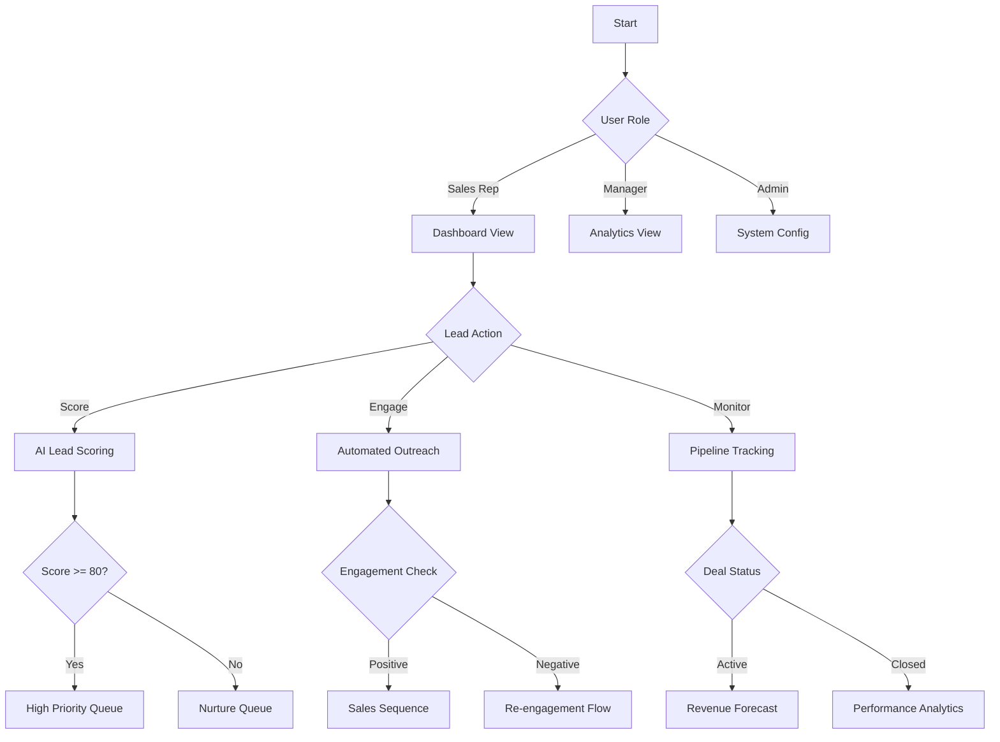
```mermaid
flowchart TD
    A[Start] --> B{User Role}
    B -->|Sales Rep| C[Dashboard View]
    B -->|Manager| D[Analytics View]
    B -->|Admin| E[System Config]
    
    C --> F{Lead Action}
    F -->|Score| G[AI Lead Scoring]
    F -->|Engage| H[Automated Outreach]
    F -->|Monitor| I[Pipeline Tracking]
    
    G --> J{Score >= 80?}
    J -->|Yes| K[High Priority Queue]
    J -->|No| L[Nurture Queue]
    
    H --> M{Engagement Check}
    M -->|Positive| N[Sales Sequence]
    M -->|Negative| O[Re-engagement Flow]
    
    I --> P{Deal Status}
    P -->|Active| Q[Revenue Forecast]
    P -->|Closed| R[Performance Analytics]
```

### 3.1.2 Integration Workflows

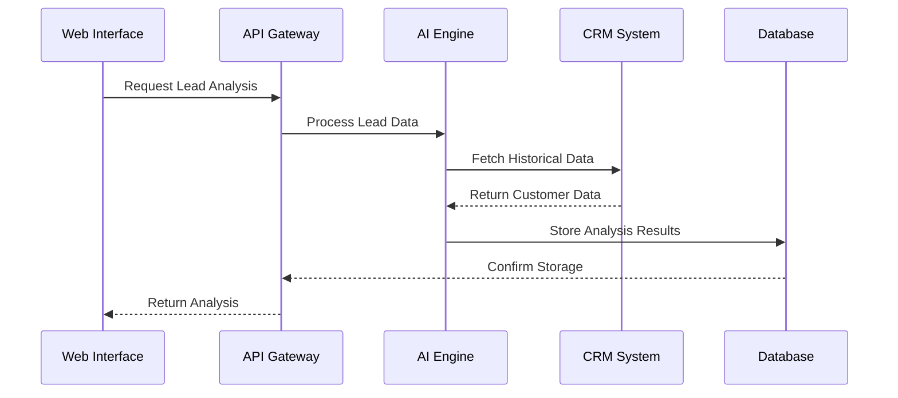
```mermaid
sequenceDiagram
    participant UI as Web Interface
    participant API as API Gateway
    participant AI as AI Engine
    participant CRM as CRM System
    participant DB as Database
    
    UI->>API: Request Lead Analysis
    API->>AI: Process Lead Data
    AI->>CRM: Fetch Historical Data
    CRM-->>AI: Return Customer Data
    AI->>DB: Store Analysis Results
    DB-->>API: Confirm Storage
    API-->>UI: Return Analysis
```

## 3.2 FLOWCHART REQUIREMENTS

### 3.2.1 Lead Management Flow

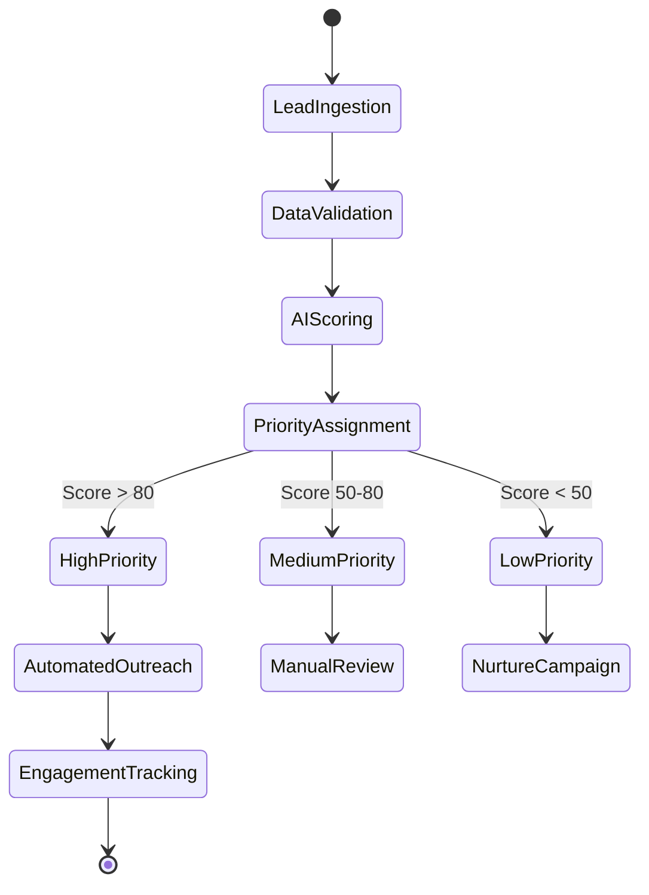
```mermaid
stateDiagram-v2
    [*] --> LeadIngestion
    LeadIngestion --> DataValidation
    DataValidation --> AIScoring
    AIScoring --> PriorityAssignment
    
    PriorityAssignment --> HighPriority: Score > 80
    PriorityAssignment --> MediumPriority: Score 50-80
    PriorityAssignment --> LowPriority: Score < 50
    
    HighPriority --> AutomatedOutreach
    MediumPriority --> ManualReview
    LowPriority --> NurtureCampaign
    
    AutomatedOutreach --> EngagementTracking
    EngagementTracking --> [*]
```

### 3.2.2 Error Handling Flow

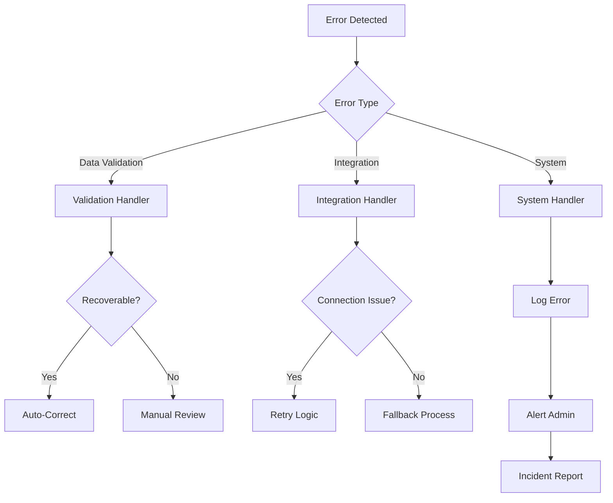
```mermaid
flowchart TD
    A[Error Detected] --> B{Error Type}
    B -->|Data Validation| C[Validation Handler]
    B -->|Integration| D[Integration Handler]
    B -->|System| E[System Handler]
    
    C --> F{Recoverable?}
    F -->|Yes| G[Auto-Correct]
    F -->|No| H[Manual Review]
    
    D --> I{Connection Issue?}
    I -->|Yes| J[Retry Logic]
    I -->|No| K[Fallback Process]
    
    E --> L[Log Error]
    L --> M[Alert Admin]
    M --> N[Incident Report]
```

## 3.3 TECHNICAL IMPLEMENTATION

### 3.3.1 State Management Flow

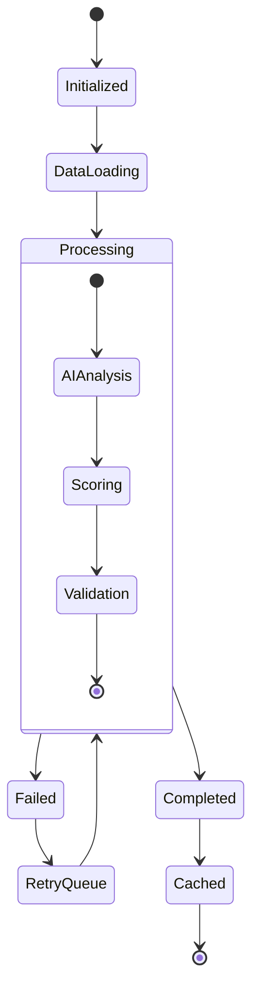
```mermaid
stateDiagram-v2
    [*] --> Initialized
    Initialized --> DataLoading
    DataLoading --> Processing
    Processing --> Completed
    Processing --> Failed
    
    Failed --> RetryQueue
    RetryQueue --> Processing
    
    Completed --> Cached
    Cached --> [*]
    
    state Processing {
        [*] --> AIAnalysis
        AIAnalysis --> Scoring
        Scoring --> Validation
        Validation --> [*]
    }
```

### 3.3.2 Integration Sequence

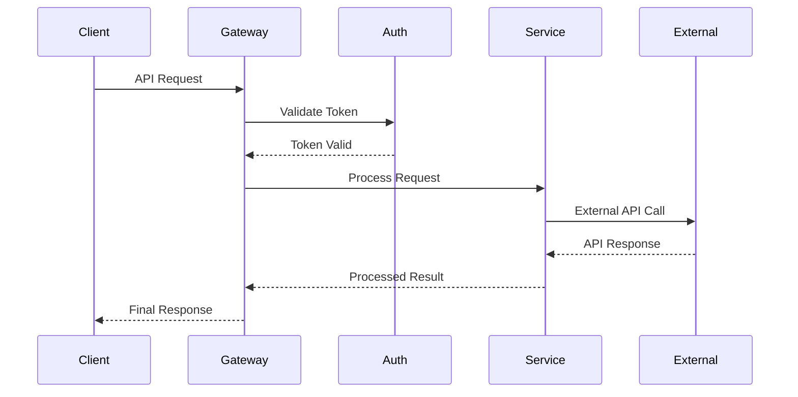
```mermaid
sequenceDiagram
    participant Client
    participant Gateway
    participant Auth
    participant Service
    participant External
    
    Client->>Gateway: API Request
    Gateway->>Auth: Validate Token
    Auth-->>Gateway: Token Valid
    Gateway->>Service: Process Request
    Service->>External: External API Call
    External-->>Service: API Response
    Service-->>Gateway: Processed Result
    Gateway-->>Client: Final Response
```

## 3.4 VALIDATION RULES

| Process Step | Validation Rules | Authorization Requirements |
| --- | --- | --- |
| Lead Ingestion | - Required fields check<br>- Email format validation<br>- Phone number format | - API key validation<br>- Rate limiting |
| AI Scoring | - Minimum data points<br>- Score range validation<br>- Confidence threshold | - Model access rights<br>- Data access permissions |
| Outreach | - Communication preferences<br>- GDPR compliance<br>- Frequency limits | - Template access<br>- Send permissions |
| Integration | - API response validation<br>- Data format check<br>- Schema validation | - OAuth tokens<br>- System credentials |

## 3.5 ERROR HANDLING SPECIFICATIONS

| Error Type | Retry Strategy | Fallback Process | Notification |
| --- | --- | --- | --- |
| API Timeout | 3 attempts, exponential backoff | Cache response | Admin alert |
| Data Validation | None | Manual review queue | User notification |
| Integration Failure | 5 attempts, 1-minute intervals | Offline processing | System alert |
| AI Processing | 2 attempts | Rule-based scoring | Technical alert |

# 4. SYSTEM ARCHITECTURE

## 4.1 HIGH-LEVEL ARCHITECTURE

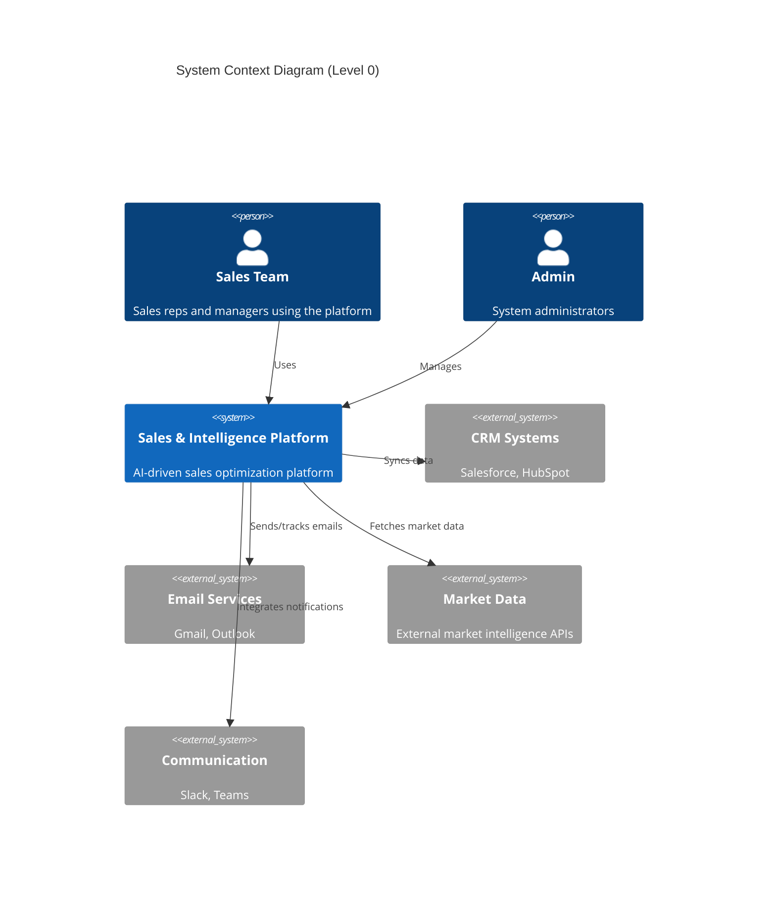
```mermaid
C4Context
    title System Context Diagram (Level 0)
    
    Person(sales, "Sales Team", "Sales reps and managers using the platform")
    Person(admin, "Admin", "System administrators")
    
    System(sip, "Sales & Intelligence Platform", "AI-driven sales optimization platform")
    
    System_Ext(crm, "CRM Systems", "Salesforce, HubSpot")
    System_Ext(email, "Email Services", "Gmail, Outlook")
    System_Ext(market, "Market Data", "External market intelligence APIs")
    System_Ext(comms, "Communication", "Slack, Teams")
    
    Rel(sales, sip, "Uses")
    Rel(admin, sip, "Manages")
    Rel(sip, crm, "Syncs data")
    Rel(sip, email, "Sends/tracks emails")
    Rel(sip, market, "Fetches market data")
    Rel(sip, comms, "Integrates notifications")
```

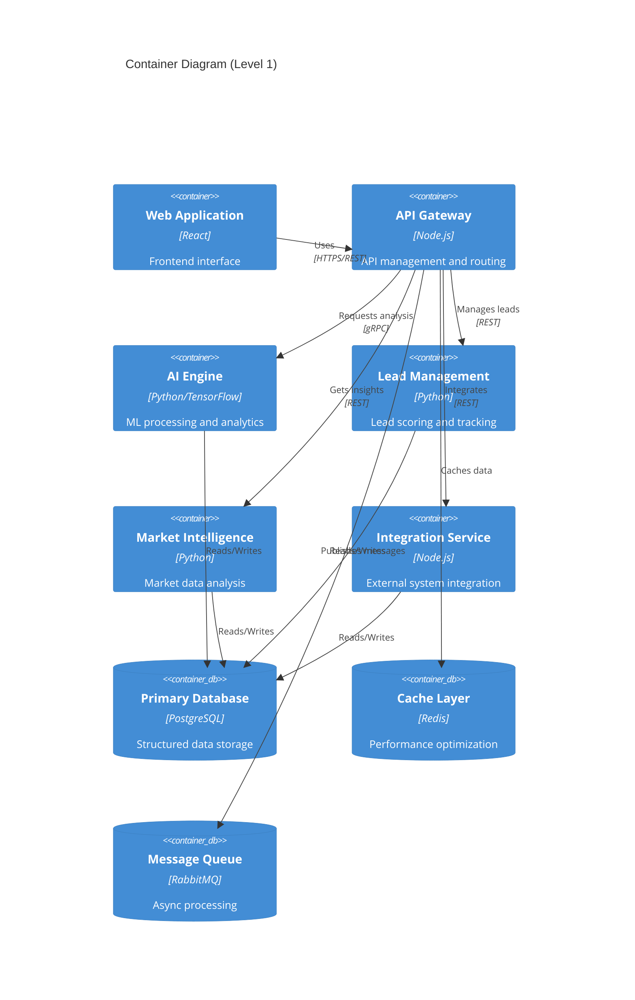
```mermaid
C4Container
    title Container Diagram (Level 1)
    
    Container(web, "Web Application", "React", "Frontend interface")
    Container(api, "API Gateway", "Node.js", "API management and routing")
    Container(ai, "AI Engine", "Python/TensorFlow", "ML processing and analytics")
    Container(lead, "Lead Management", "Python", "Lead scoring and tracking")
    Container(market, "Market Intelligence", "Python", "Market data analysis")
    Container(int, "Integration Service", "Node.js", "External system integration")
    
    ContainerDb(db, "Primary Database", "PostgreSQL", "Structured data storage")
    ContainerDb(cache, "Cache Layer", "Redis", "Performance optimization")
    ContainerDb(queue, "Message Queue", "RabbitMQ", "Async processing")
    
    Rel(web, api, "Uses", "HTTPS/REST")
    Rel(api, ai, "Requests analysis", "gRPC")
    Rel(api, lead, "Manages leads", "REST")
    Rel(api, market, "Gets insights", "REST")
    Rel(api, int, "Integrates", "REST")
    
    Rel(ai, db, "Reads/Writes")
    Rel(lead, db, "Reads/Writes")
    Rel(market, db, "Reads/Writes")
    Rel(int, db, "Reads/Writes")
    
    Rel(api, cache, "Caches data")
    Rel(api, queue, "Publishes messages")
```

## 4.2 COMPONENT DETAILS

| Component | Purpose | Technologies | Scaling Strategy | Data Requirements |
| --- | --- | --- | --- | --- |
| Web Application | User interface | React, Redux, Material-UI | Horizontal scaling, CDN | Browser caching |
| API Gateway | Request routing | Node.js, Express | Load balancing, Auto-scaling | In-memory caching |
| AI Engine | ML processing | Python, TensorFlow, scikit-learn | GPU instances, Model parallelization | High-performance storage |
| Lead Management | Lead processing | Python, FastAPI | Horizontal scaling | ACID compliance |
| Market Intelligence | Data analysis | Python, Pandas | Worker scaling | Time-series optimization |
| Integration Service | External connectivity | Node.js, OAuth | Regional deployment | Queue persistence |

## 4.3 TECHNICAL DECISIONS

### Architecture Style

| Decision | Rationale | Trade-offs |
| --- | --- | --- |
| Microservices | Independent scaling, Technology flexibility | Increased complexity |
| Event-driven | Real-time processing, Loose coupling | Message consistency |
| API-first | Integration flexibility, Third-party compatibility | API maintenance |

### Data Storage

| Store Type | Technology | Use Case | Scaling Approach |
| --- | --- | --- | --- |
| Primary DB | PostgreSQL | Structured data | Master-slave replication |
| Cache | Redis | Session, API responses | Cluster sharding |
| Queue | RabbitMQ | Async processing | Mirror queues |
| Search | Elasticsearch | Full-text search | Index sharding |

## 4.4 CROSS-CUTTING CONCERNS

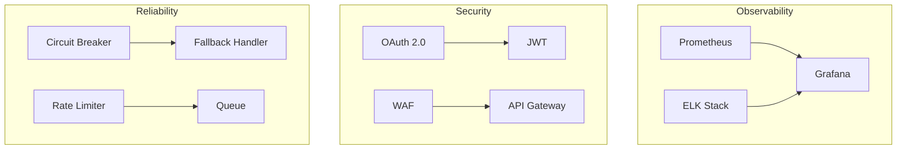
```mermaid
graph TB
    subgraph "Observability"
        A[Prometheus] --> B[Grafana]
        C[ELK Stack] --> B
    end
    
    subgraph "Security"
        D[OAuth 2.0] --> E[JWT]
        F[WAF] --> G[API Gateway]
    end
    
    subgraph "Reliability"
        H[Circuit Breaker] --> I[Fallback Handler]
        J[Rate Limiter] --> K[Queue]
    end
```

## 4.5 DEPLOYMENT ARCHITECTURE

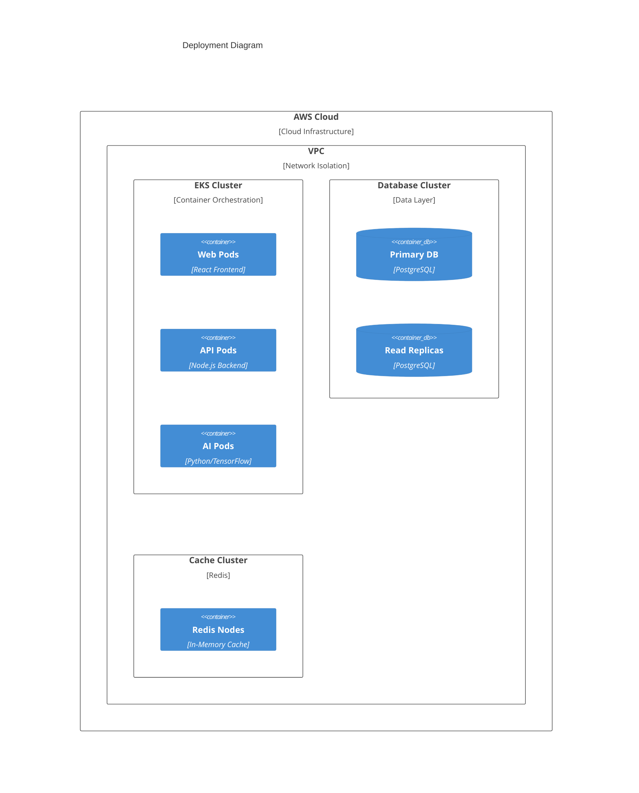
```mermaid
C4Deployment
    title Deployment Diagram
    
    Deployment_Node(aws, "AWS Cloud", "Cloud Infrastructure"){
        Deployment_Node(vpc, "VPC", "Network Isolation"){
            Deployment_Node(eks, "EKS Cluster", "Container Orchestration"){
                Container(web, "Web Pods", "React Frontend")
                Container(api, "API Pods", "Node.js Backend")
                Container(ai, "AI Pods", "Python/TensorFlow")
            }
            
            Deployment_Node(dbs, "Database Cluster", "Data Layer"){
                ContainerDb(primary, "Primary DB", "PostgreSQL")
                ContainerDb(replica, "Read Replicas", "PostgreSQL")
            }
            
            Deployment_Node(cache, "Cache Cluster", "Redis"){
                Container(redis, "Redis Nodes", "In-Memory Cache")
            }
        }
    }
```

## 4.6 DATA FLOW

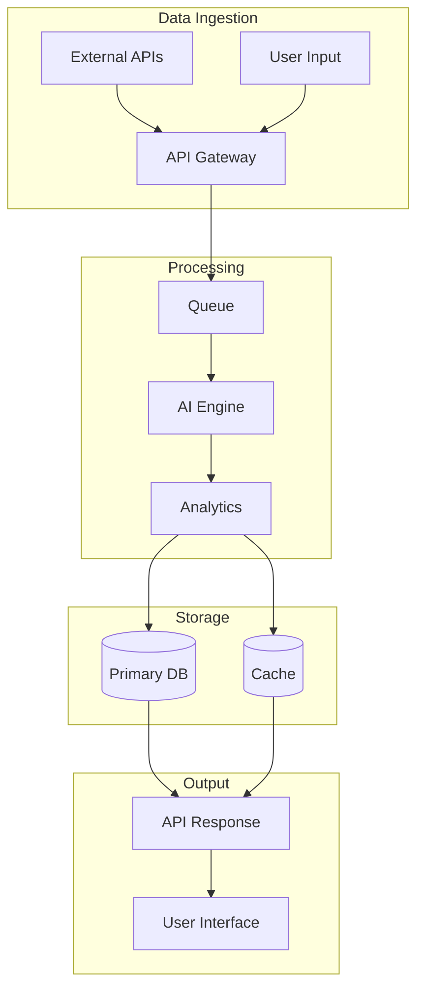
```mermaid
flowchart TD
    subgraph "Data Ingestion"
        A[External APIs] --> B[API Gateway]
        C[User Input] --> B
    end
    
    subgraph "Processing"
        B --> D[Queue]
        D --> E[AI Engine]
        E --> F[Analytics]
    end
    
    subgraph "Storage"
        F --> G[(Primary DB)]
        F --> H[(Cache)]
    end
    
    subgraph "Output"
        G --> I[API Response]
        H --> I
        I --> J[User Interface]
    end
```

# 5. SYSTEM COMPONENTS DESIGN

## 5.1 CORE SERVICES ARCHITECTURE

### Service Components

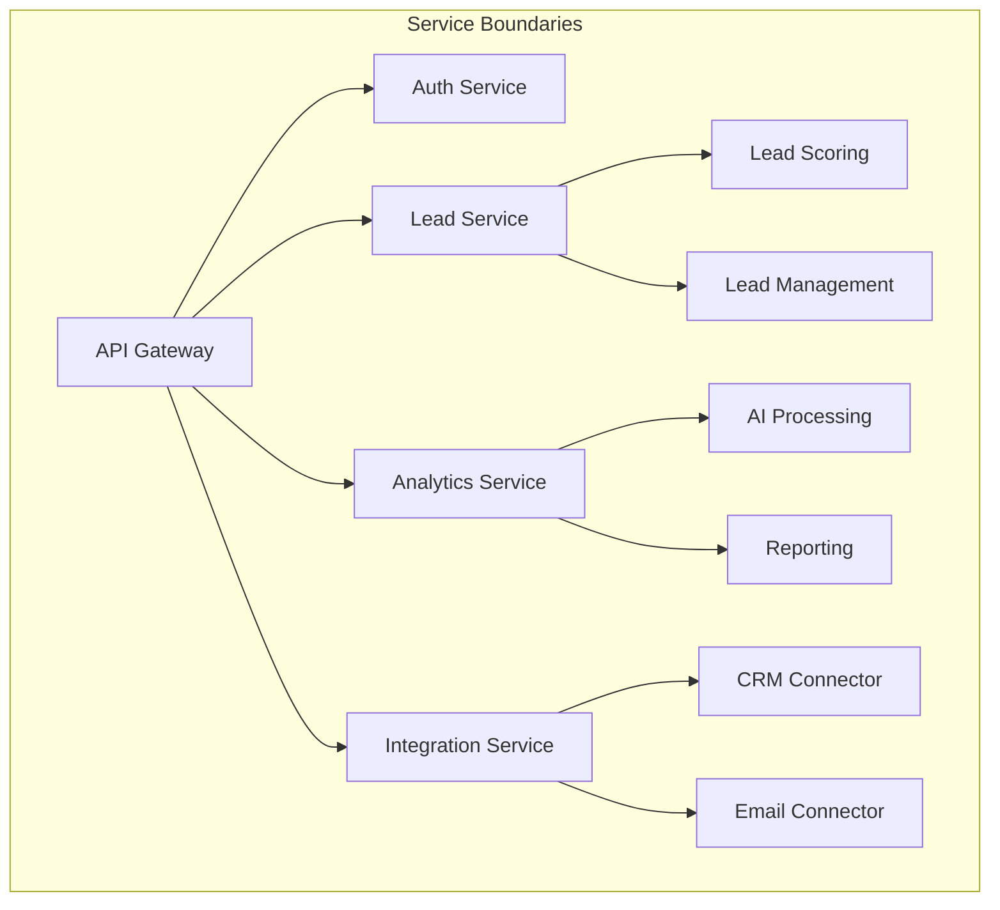
```mermaid
graph TB
    subgraph "Service Boundaries"
        A[API Gateway] --> B[Auth Service]
        A --> C[Lead Service]
        A --> D[Analytics Service]
        A --> E[Integration Service]
        
        C --> F[Lead Scoring]
        C --> G[Lead Management]
        
        D --> H[AI Processing]
        D --> I[Reporting]
        
        E --> J[CRM Connector]
        E --> K[Email Connector]
    end
```

| Service | Responsibility | Communication Pattern | Discovery Method |
| --- | --- | --- | --- |
| API Gateway | Request routing, rate limiting | REST/GraphQL | DNS with AWS Route53 |
| Auth Service | Authentication, authorization | gRPC | Kubernetes Service |
| Lead Service | Lead processing, scoring | Event-driven | Service Mesh |
| Analytics Service | AI processing, reporting | Async messaging | DNS with health checks |
| Integration Service | External system connectivity | REST/WebSocket | Service Registry |

#### Load Balancing Strategy

| Component | Strategy | Algorithm | Health Checks |
| --- | --- | --- | --- |
| API Gateway | Layer 7 | Round Robin | TCP/HTTP checks |
| Services | Service Mesh | Least Connection | Custom probes |
| Database | Connection Pool | Random Selection | Replica lag |

#### Circuit Breaker Configuration

| Service | Threshold | Timeout | Reset Time | Fallback |
| --- | --- | --- | --- | --- |
| CRM Integration | 5 failures | 5s | 30s | Cache response |
| AI Processing | 3 failures | 10s | 60s | Rule-based scoring |
| Email Service | 4 failures | 3s | 45s | Queue message |

### Scalability Design

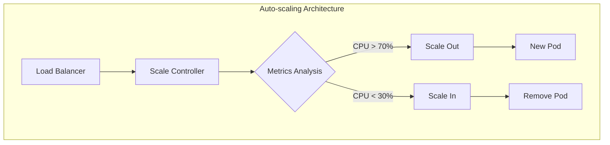
```mermaid
flowchart TD
    subgraph "Auto-scaling Architecture"
        A[Load Balancer] --> B[Scale Controller]
        B --> C{Metrics Analysis}
        C -->|CPU > 70%| D[Scale Out]
        C -->|CPU < 30%| E[Scale In]
        D --> F[New Pod]
        E --> G[Remove Pod]
    end
```

| Component | Scaling Approach | Triggers | Resource Allocation |
| --- | --- | --- | --- |
| Web Tier | Horizontal | CPU \> 70%, Memory \> 80% | 2-8 pods |
| API Tier | Horizontal | Request count \> 1000/s | 3-12 pods |
| AI Engine | Vertical | GPU utilization \> 85% | 4-16 GPUs |
| Database | Read Replicas | Replica lag \> 100ms | 3-6 replicas |

### Resilience Patterns

| Pattern | Implementation | Recovery Time | Data Protection |
| --- | --- | --- | --- |
| Circuit Breaker | Hystrix | 30s timeout | Cache fallback |
| Retry Logic | Exponential backoff | 3 attempts | Queue persistence |
| Failover | Active-passive | \< 1 minute | Cross-region sync |
| Rate Limiting | Token bucket | N/A | Request queuing |

## 5.2 DATABASE DESIGN

### Schema Design

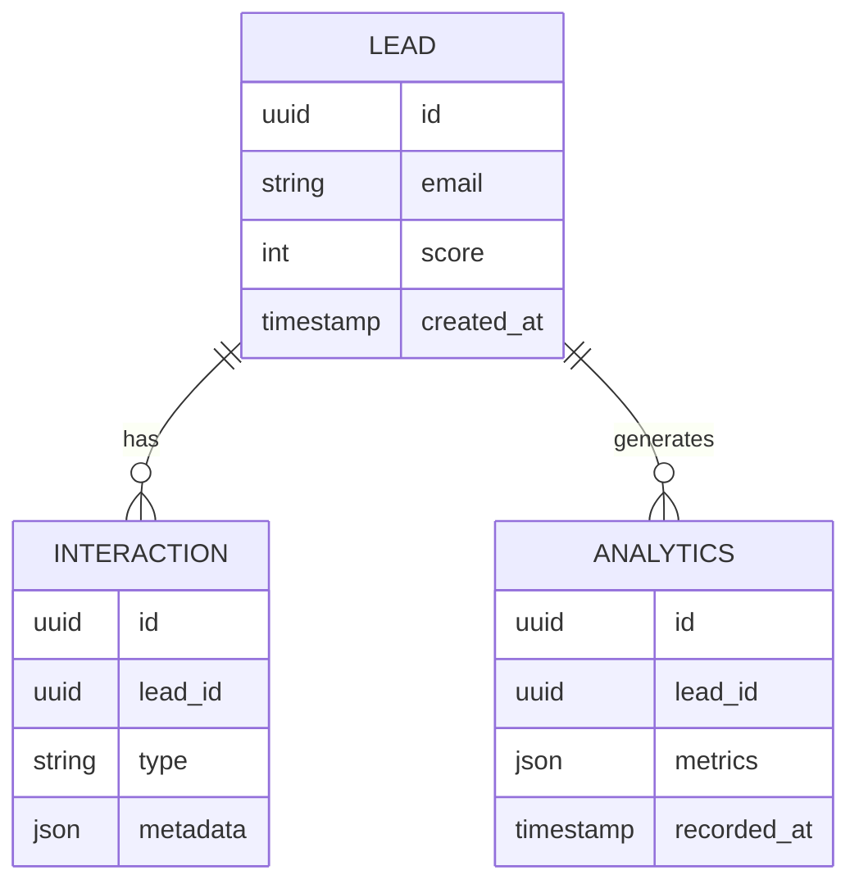
```mermaid
erDiagram
    LEAD {
        uuid id
        string email
        int score
        timestamp created_at
    }
    INTERACTION {
        uuid id
        uuid lead_id
        string type
        json metadata
    }
    ANALYTICS {
        uuid id
        uuid lead_id
        json metrics
        timestamp recorded_at
    }
    LEAD ||--o{ INTERACTION : has
    LEAD ||--o{ ANALYTICS : generates
```

#### Indexing Strategy

| Table | Index Type | Columns | Purpose |
| --- | --- | --- | --- |
| Lead | B-tree | email, score | Fast lookup |
| Interaction | Hash | lead_id | Foreign key |
| Analytics | Time-series | recorded_at | Time-based queries |

### Data Management

| Aspect | Strategy | Tools | Frequency |
| --- | --- | --- | --- |
| Migration | Blue-green | Flyway | As needed |
| Versioning | Semantic | GitOps | Per release |
| Archival | Cold storage | S3 Glacier | Monthly |
| Retention | Time-based | Custom jobs | 90 days |

### Performance Optimization

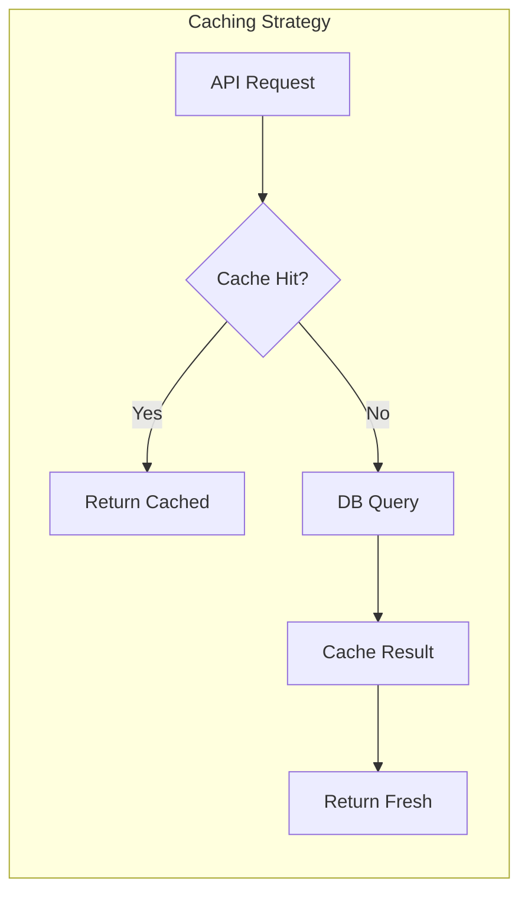
```mermaid
flowchart LR
    subgraph "Caching Strategy"
        A[API Request] --> B{Cache Hit?}
        B -->|Yes| C[Return Cached]
        B -->|No| D[DB Query]
        D --> E[Cache Result]
        E --> F[Return Fresh]
    end
```

| Optimization | Implementation | Impact | Monitoring |
| --- | --- | --- | --- |
| Query Cache | Redis | 50ms → 5ms | Cache hit ratio |
| Connection Pool | HikariCP | Reduced overhead | Pool utilization |
| Read Replicas | PostgreSQL | Load distribution | Replica lag |

## 5.3 INTEGRATION ARCHITECTURE

### API Design

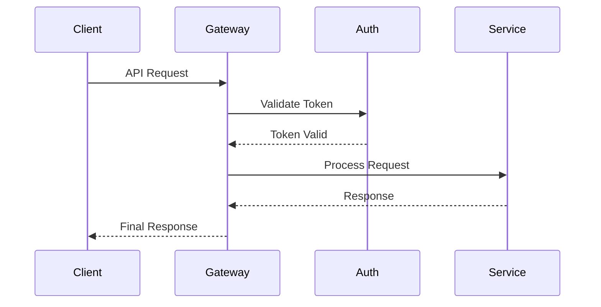
```mermaid
sequenceDiagram
    participant Client
    participant Gateway
    participant Auth
    participant Service
    
    Client->>Gateway: API Request
    Gateway->>Auth: Validate Token
    Auth-->>Gateway: Token Valid
    Gateway->>Service: Process Request
    Service-->>Gateway: Response
    Gateway-->>Client: Final Response
```

| Aspect | Specification | Implementation |
| --- | --- | --- |
| Protocol | REST/GraphQL | Express/Apollo |
| Auth | OAuth 2.0/JWT | Custom middleware |
| Rate Limit | Token bucket | Redis-based |
| Versioning | URI-based | v1/v2 endpoints |

### Message Processing

| Pattern | Technology | Use Case | Error Handling |
| --- | --- | --- | --- |
| Event Stream | Kafka | Real-time updates | DLQ retry |
| Message Queue | RabbitMQ | Async tasks | Retry with backoff |
| Batch Process | Bull | Scheduled jobs | Manual intervention |

## 5.4 SECURITY ARCHITECTURE

### Authentication Framework

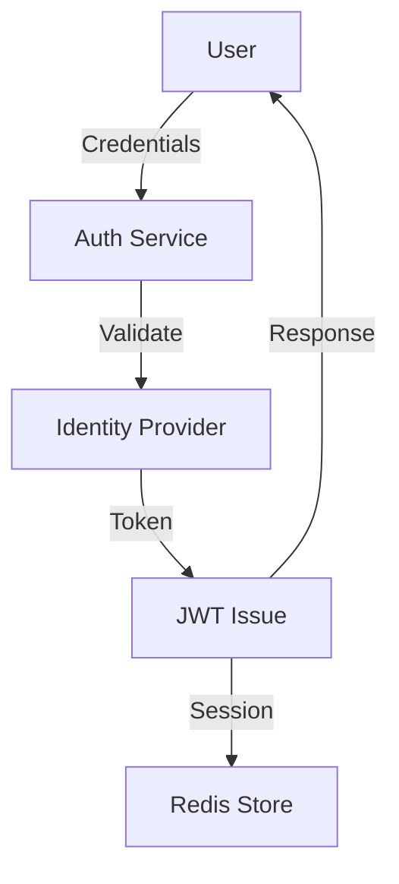
```mermaid
flowchart TD
    A[User] -->|Credentials| B[Auth Service]
    B -->|Validate| C[Identity Provider]
    C -->|Token| D[JWT Issue]
    D -->|Session| E[Redis Store]
    D -->|Response| A
```

| Component | Implementation | Standard | Renewal |
| --- | --- | --- | --- |
| Identity | OAuth 2.0 | OpenID Connect | Auto-refresh |
| MFA | TOTP | RFC 6238 | 30s rotation |
| Session | JWT | RFC 7519 | 1h expiry |

### Authorization System

| Level | Implementation | Scope | Audit |
| --- | --- | --- | --- |
| RBAC | Custom roles | Service-level | Full logging |
| ABAC | Policy engine | Resource-level | Event tracking |
| OAuth | Scopes | API-level | Token tracking |

### Data Protection

| Security Control | Standard | Implementation |
| --- | --- | --- |
| Encryption | AES-256 | TLS 1.3 |
| Key Management | AWS KMS | Auto-rotation |
| Data Masking | Custom rules | PII protection |

# 6. TECHNOLOGY STACK

## 6.1 PROGRAMMING LANGUAGES

| Layer | Language | Version | Justification |
| --- | --- | --- | --- |
| Frontend | TypeScript | 5.0+ | Type safety, better maintainability for large-scale React applications |
| Backend API | Node.js | 20 LTS | High performance for API Gateway, excellent ecosystem for integrations |
| AI/ML Services | Python | 3.11+ | Superior ML libraries, TensorFlow/scikit-learn support |
| Data Processing | Python | 3.11+ | Pandas/NumPy optimization, async capabilities |
| DevOps Scripts | Go | 1.21+ | Efficient containerization tools, cross-platform compatibility |

## 6.2 FRAMEWORKS & LIBRARIES

### Frontend Stack

| Component | Technology | Version | Purpose |
| --- | --- | --- | --- |
| UI Framework | React | 18.2+ | Component reusability, virtual DOM performance |
| State Management | Redux Toolkit | 2.0+ | Predictable state updates, RTK Query for data fetching |
| UI Components | Material-UI | 5.0+ | Enterprise-grade components, customization |
| Data Visualization | D3.js | 7.0+ | Complex analytics visualizations |
| WebSocket | Socket.io | 4.0+ | Real-time updates and notifications |

### Backend Stack

| Component | Technology | Version | Purpose |
| --- | --- | --- | --- |
| API Framework | Express.js | 4.18+ | REST API endpoints, middleware support |
| ML Framework | TensorFlow | 2.14+ | AI model training and inference |
| GraphQL | Apollo Server | 4.0+ | Flexible data querying |
| Validation | Joi | 17.0+ | Request payload validation |
| ORM | Prisma | 5.0+ | Type-safe database queries |

## 6.3 DATABASES & STORAGE

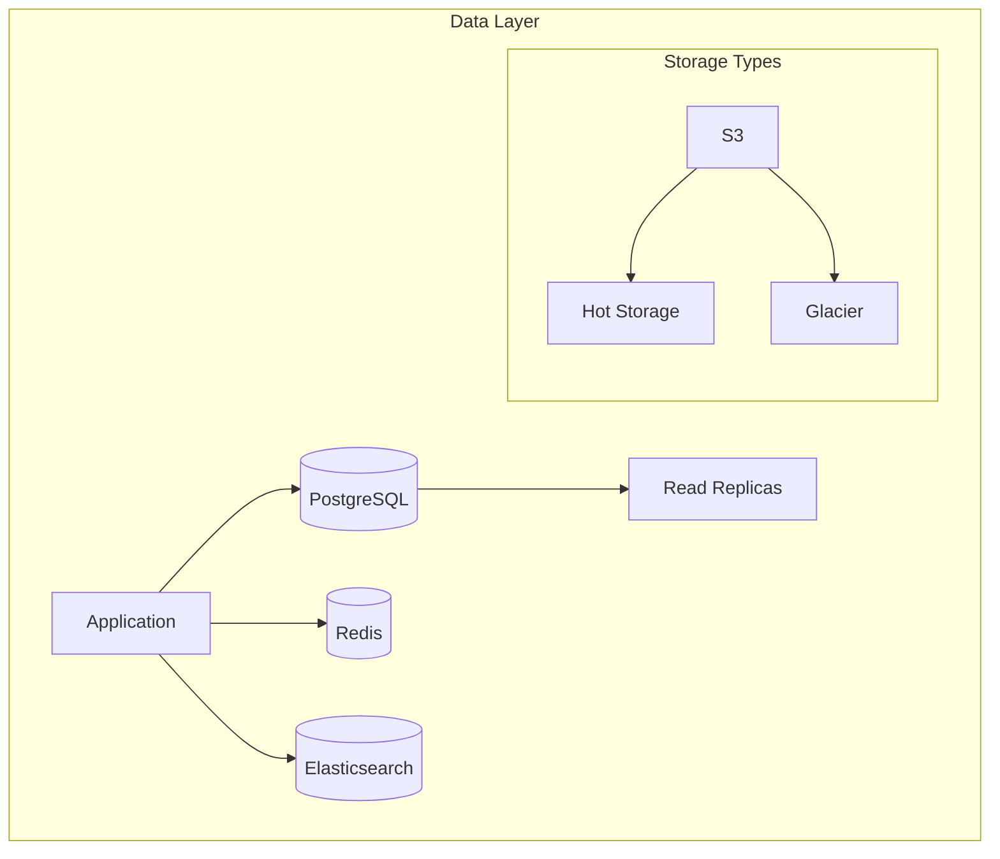
```mermaid
flowchart TD
    subgraph "Data Layer"
        A[Application] --> B[(PostgreSQL)]
        A --> C[(Redis)]
        A --> D[(Elasticsearch)]
        B --> E[Read Replicas]
        
        subgraph "Storage Types"
            F[S3] --> G[Hot Storage]
            F --> H[Glacier]
        end
    end
```

| Type | Technology | Version | Use Case |
| --- | --- | --- | --- |
| Primary Database | PostgreSQL | 15+ | Transactional data, ACID compliance |
| Cache Layer | Redis | 7.0+ | Session management, API caching |
| Search Engine | Elasticsearch | 8.0+ | Full-text search, analytics |
| Message Queue | RabbitMQ | 3.12+ | Async processing |
| Object Storage | AWS S3 | - | File storage, backups |

## 6.4 THIRD-PARTY SERVICES

### Integration Matrix

| Service Type | Provider | Integration Method | Purpose |
| --- | --- | --- | --- |
| CRM | Salesforce API | REST/OAuth 2.0 | Customer data sync |
| Email | SendGrid | SMTP/API | Automated outreach |
| Analytics | Mixpanel | SDK/API | User behavior tracking |
| Monitoring | DataDog | Agent/API | System monitoring |
| Authentication | Auth0 | OAuth/OIDC | Identity management |

### Cloud Services

| Service | Provider | Purpose |
| --- | --- | --- |
| Compute | AWS EKS | Container orchestration |
| CDN | CloudFront | Static content delivery |
| DNS | Route 53 | Domain management |
| SSL | ACM | Certificate management |
| AI Services | AWS SageMaker | ML model deployment |

## 6.5 DEVELOPMENT & DEPLOYMENT

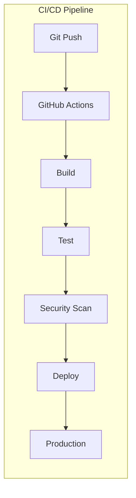
```mermaid
flowchart LR
    subgraph "CI/CD Pipeline"
        A[Git Push] --> B[GitHub Actions]
        B --> C[Build]
        C --> D[Test]
        D --> E[Security Scan]
        E --> F[Deploy]
        F --> G[Production]
    end
```

### Development Environment

| Tool | Version | Purpose |
| --- | --- | --- |
| VS Code | Latest | Primary IDE |
| Docker Desktop | Latest | Local containerization |
| Node.js | 20 LTS | Local development |
| Python | 3.11+ | AI development |
| kubectl | Latest | Kubernetes management |

### Build & Deployment

| Component | Technology | Configuration |
| --- | --- | --- |
| Container Runtime | Docker | Multi-stage builds |
| Orchestration | Kubernetes | EKS managed |
| Infrastructure | Terraform | AWS resources |
| CI/CD | GitHub Actions | Automated pipeline |
| Monitoring | Prometheus/Grafana | Metrics/Dashboards |

# 7. USER INTERFACE DESIGN

## 7.1 DESIGN SYSTEM

### Symbol Key

```
Icons:
[?] - Help/Info tooltip
[$] - Financial data
[i] - Information
[+] - Add/Create new
[x] - Close/Delete
[<][>] - Navigation
[^] - Upload
[#] - Menu/Dashboard
[@] - User profile
[!] - Alerts/Warnings
[=] - Settings menu
[*] - Favorite/Important

Interactive Elements:
[ ] - Checkbox
( ) - Radio button
[Button] - Clickable button
[...] - Text input field
[====] - Progress bar
[v] - Dropdown menu
```

## 7.2 MAIN DASHBOARD

```
+----------------------------------------------------------+
|  Sales & Intelligence Platform             [@] [?] [=]     |
+----------------------------------------------------------+
|  [#] Dashboard                                            |
|  +-- Analytics                                            |
|  +-- Leads                                                |
|  +-- Intelligence                                         |
|  +-- Reports                                              |
+------------------+---------------------+-------------------+
|                  |                     |                   |
| LEAD SCORING     | PIPELINE STATUS     | AI INSIGHTS      |
| [====== 75%]     | [$] $1.2M Active   | [!] 3 New        |
|                  |                     |                   |
| High Priority: 12| [===== 60%]        | - Competitor Alert|
| Medium: 45       | Q3 Target Progress  | - Market Trend   |
| Low: 23         |                     | - Deal Risk       |
|                  |                     |                   |
| [View All]       | [Forecast]         | [See Details]     |
+------------------+---------------------+-------------------+
```

## 7.3 LEAD MANAGEMENT

```
+----------------------------------------------------------+
|  Lead Management                         [+] Add Lead      |
+----------------------------------------------------------+
| Search: [...........................] [Button: Search]     |
|                                                           |
| Filter: [v] Status   [v] Score   [v] Source              |
+----------------------------------------------------------+
| [ ] Name          Score   Status     Last Contact  Action |
|                                                          |
| [ ] John Smith     92     Active     2h ago      [...]   |
| [ ] Sarah Jones    87     New        1d ago      [...]   |
| [ ] Mike Brown     76     Pending    5h ago      [...]   |
+----------------------------------------------------------+
| [< Prev]    Page 1 of 5    [Next >]                      |
+----------------------------------------------------------+
```

## 7.4 AI ANALYTICS VIEW

```
+----------------------------------------------------------+
|  Analytics Dashboard              [^] Export   [?] Help    |
+----------------------------------------------------------+
|                                                           |
|  REVENUE FORECAST          CONVERSION METRICS             |
|                                                           |
|  $2.5M +                   Lead-to-Opportunity           |
|        |    [*]            [======== 80%]                |
|  $1.5M |   [*] [*]                                       |
|        | [*]               Opportunity-to-Close           |
|  $0.5M |                   [===== 50%]                   |
|        +------------------                               |
|        Q1  Q2  Q3  Q4                                    |
|                                                           |
|  [Button: View Details]    [Button: Analysis]            |
+----------------------------------------------------------+
```

## 7.5 COMPETITOR TRACKING

```
+----------------------------------------------------------+
|  Market Intelligence                    [$] Price Alerts   |
+----------------------------------------------------------+
| Competitor Activity Feed                                  |
|                                                           |
| [!] Competitor A                                         |
| +-- New product launch detected                          |
| +-- Price change: -5% on Enterprise Plan                 |
|                                                           |
| [i] Competitor B                                         |
| +-- Marketing campaign in target segment                 |
| +-- New partnership announced                            |
|                                                           |
| [*] Tracked Keywords                                     |
| +-- AI Sales Platform [====== 65%] Mention trend        |
| +-- Revenue Intelligence [==== 45%] Market share        |
+----------------------------------------------------------+
```

## 7.6 SETTINGS & CONFIGURATION

```
+----------------------------------------------------------+
|  System Settings                       [@] Profile         |
+----------------------------------------------------------+
|                                                           |
| Integration Settings                                      |
| ( ) Salesforce Connected                                  |
| ( ) HubSpot Connected                                    |
| ( ) LinkedIn Sales Navigator                             |
|                                                           |
| Notification Preferences                                  |
| [ ] Lead score changes                                   |
| [ ] Competitor alerts                                    |
| [ ] Pipeline updates                                     |
| [ ] AI insights                                          |
|                                                           |
| [Button: Save Changes]    [Button: Test Connections]      |
+----------------------------------------------------------+
```

## 7.7 RESPONSIVE DESIGN SPECIFICATIONS

| Breakpoint | Layout Changes | Component Adjustments |
| --- | --- | --- |
| Desktop (1200px+) | Full 3-column dashboard | All components visible |
| Tablet (768px-1199px) | 2-column layout | Collapsed sidebar menu |
| Mobile (320px-767px) | Single column | Stacked cards, hamburger menu |

## 7.8 INTERACTION PATTERNS

| Component | Primary Action | Secondary Action | Feedback |
| --- | --- | --- | --- |
| Lead Card | Click to expand | Swipe for quick actions | Visual highlight |
| AI Insights | Tap to view details | Long press to mark important | Toast notification |
| Dashboard Widgets | Drag to reorder | Double click to maximize | Animation |
| Navigation | Single click | Hover for preview | Highlight active |

# 8. INFRASTRUCTURE

## 8.1 DEPLOYMENT ENVIRONMENT

| Environment | Purpose | Configuration | Scaling Strategy |
| --- | --- | --- | --- |
| Development | Feature development, testing | Single-region AWS | Manual scaling |
| Staging | Pre-production validation | Multi-AZ AWS | Auto-scaling groups |
| Production | Live system | Multi-region AWS | Kubernetes-based auto-scaling |
| DR | Disaster recovery | Secondary region | Active-passive failover |

### Environment Specifications

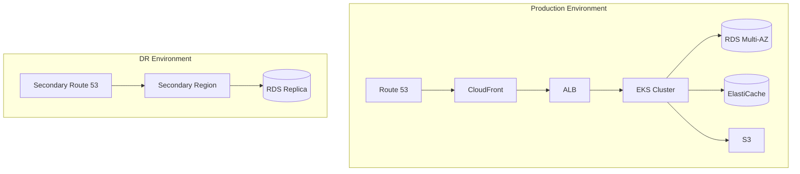
```mermaid
flowchart TB
    subgraph "Production Environment"
        A[Route 53] --> B[CloudFront]
        B --> C[ALB]
        C --> D[EKS Cluster]
        D --> E[(RDS Multi-AZ)]
        D --> F[(ElastiCache)]
        D --> G[S3]
    end
    
    subgraph "DR Environment"
        H[Secondary Route 53] --> I[Secondary Region]
        I --> J[(RDS Replica)]
    end
```

## 8.2 CLOUD SERVICES

| Service Category | AWS Service | Purpose | Configuration |
| --- | --- | --- | --- |
| Compute | EKS | Container orchestration | Production: 3-5 node groups<br>Node type: m5.2xlarge |
| Database | RDS PostgreSQL | Primary data store | Multi-AZ, Read replicas |
| Cache | ElastiCache | Session and API caching | Redis cluster mode |
| Storage | S3 | Object storage | Standard + Glacier |
| CDN | CloudFront | Static content delivery | Global edge locations |
| DNS | Route 53 | DNS management | Active-active routing |
| ML Infrastructure | SageMaker | AI model hosting | GPU instances |

## 8.3 CONTAINERIZATION

### Docker Configuration

```mermaid
flowchart LR
    subgraph "Container Architecture"
        A[Base Image] --> B[Dependencies]
        B --> C[Application Code]
        C --> D[Final Image]
        
        E[Development] --> F[Multi-stage Build]
        F --> G[Production Image]
    end
```

| Component | Base Image | Size Optimization | Security Measures |
| --- | --- | --- | --- |
| Frontend | node:20-alpine | Multi-stage build | Non-root user |
| Backend API | node:20-alpine | Layer optimization | Security scanning |
| AI Services | python:3.11-slim | Minimal dependencies | Vulnerability checks |
| Data Processing | python:3.11-slim | Optimized packages | Read-only filesystem |

## 8.4 ORCHESTRATION

### Kubernetes Architecture

```mermaid
flowchart TB
    subgraph "EKS Cluster"
        A[Ingress Controller] --> B[Service Mesh]
        B --> C[Application Pods]
        B --> D[AI Service Pods]
        B --> E[Processing Pods]
        
        F[Auto-scaler] --> C
        F --> D
        F --> E
    end
```

| Component | Configuration | Scaling Policy | Resource Limits |
| --- | --- | --- | --- |
| Frontend | 3-10 pods | CPU \> 70% | 1 CPU, 2GB RAM |
| Backend API | 5-20 pods | Request count | 2 CPU, 4GB RAM |
| AI Services | 2-8 pods | GPU utilization | 4 CPU, 8GB RAM |
| Data Processing | 3-12 pods | Queue length | 2 CPU, 4GB RAM |

## 8.5 CI/CD PIPELINE

### Pipeline Architecture

```mermaid
flowchart LR
    subgraph "CI/CD Flow"
        A[Git Push] --> B[GitHub Actions]
        B --> C[Build & Test]
        C --> D[Security Scan]
        D --> E[Container Registry]
        E --> F[ArgoCD]
        F --> G[EKS Deployment]
    end
```

### Pipeline Stages

| Stage | Tools | Actions | Success Criteria |
| --- | --- | --- | --- |
| Code Analysis | SonarQube | Static analysis, code quality | Coverage \> 80% |
| Security | Snyk, OWASP | Vulnerability scanning | Zero high severity |
| Build | Docker | Multi-stage builds | All tests pass |
| Test | Jest, PyTest | Unit, integration tests | 100% pass rate |
| Deploy | ArgoCD | GitOps deployment | Health checks pass |

### Deployment Strategy

| Environment | Strategy | Rollback Plan | Monitoring |
| --- | --- | --- | --- |
| Development | Direct push | Manual revert | Basic metrics |
| Staging | Blue-green | Automated switch | Full telemetry |
| Production | Canary | Automated rollback | Advanced monitoring |

### Infrastructure as Code

```mermaid
flowchart TB
    subgraph "IaC Pipeline"
        A[Terraform Code] --> B[Plan]
        B --> C[Security Check]
        C --> D[Apply]
        D --> E[Validation]
    end
```

| Tool | Purpose | State Management | Change Control |
| --- | --- | --- | --- |
| Terraform | Infrastructure provisioning | S3 + DynamoDB | PR approval |
| Helm | Kubernetes packages | GitOps | Version control |
| AWS CDK | Cloud resources | CloudFormation | Change sets |

# APPENDICES

## A.1 ADDITIONAL TECHNICAL INFORMATION

### A.1.1 AI Model Specifications

| Model Type | Framework | Training Data Requirements | Update Frequency |
| --- | --- | --- | --- |
| Lead Scoring | TensorFlow | Min 10,000 historical leads | Monthly |
| Revenue Forecasting | scikit-learn | 12 months sales data | Quarterly |
| Market Analysis | BERT/NLP | Industry news corpus | Weekly |
| Engagement Prediction | XGBoost | Customer interaction logs | Daily |

### A.1.2 Integration Endpoints

| System | API Version | Authentication | Rate Limits |
| --- | --- | --- | --- |
| Salesforce | v54.0 | OAuth 2.0 | 100,000/day |
| HubSpot | v3 | API Key | 500,000/day |
| LinkedIn Sales Navigator | v2 | OAuth 2.0 | 100/day/user |
| Gmail | v1 | OAuth 2.0 | 1,000,000/day |
| Slack | v2 | Bot Token | 1 message/second |

### A.1.3 Data Retention Policy

```mermaid
flowchart TD
    A[Data Ingestion] --> B{Age Check}
    B -->|< 90 days| C[Hot Storage]
    B -->|90-365 days| D[Warm Storage]
    B -->|> 365 days| E[Cold Storage]
    C --> F[PostgreSQL]
    D --> G[S3 Standard]
    E --> H[S3 Glacier]
```

## A.2 GLOSSARY

| Term | Definition |
| --- | --- |
| Lead Score | AI-calculated probability of lead conversion based on behavioral data |
| Pipeline Health | Measure of sales opportunities progress and likelihood of closure |
| Market Intelligence | Actionable insights derived from competitor and industry data analysis |
| Sales Velocity | Speed at which leads move through the sales pipeline to closure |
| Engagement Index | Composite score of customer interactions across all touchpoints |
| Revenue Forecast | AI-predicted future revenue based on historical patterns and current pipeline |

## A.3 ACRONYMS

| Acronym | Full Form |
| --- | --- |
| AI | Artificial Intelligence |
| ML | Machine Learning |
| API | Application Programming Interface |
| CRM | Customer Relationship Management |
| RBAC | Role-Based Access Control |
| SLA | Service Level Agreement |
| GDPR | General Data Protection Regulation |
| CCPA | California Consumer Privacy Act |
| SOC | Service Organization Control |
| SSO | Single Sign-On |
| GPU | Graphics Processing Unit |
| CDN | Content Delivery Network |
| DLQ | Dead Letter Queue |
| EKS | Elastic Kubernetes Service |
| IaC | Infrastructure as Code |
| CI/CD | Continuous Integration/Continuous Deployment |
| JWT | JSON Web Token |
| TOTP | Time-based One-Time Password |
| SDK | Software Development Kit |
| REST | Representational State Transfer |
| SMTP | Simple Mail Transfer Protocol |
| DNS | Domain Name System |
| SSL | Secure Sockets Layer |
| WAF | Web Application Firewall |
| VPC | Virtual Private Cloud |
| AZ | Availability Zone |
| DR | Disaster Recovery |